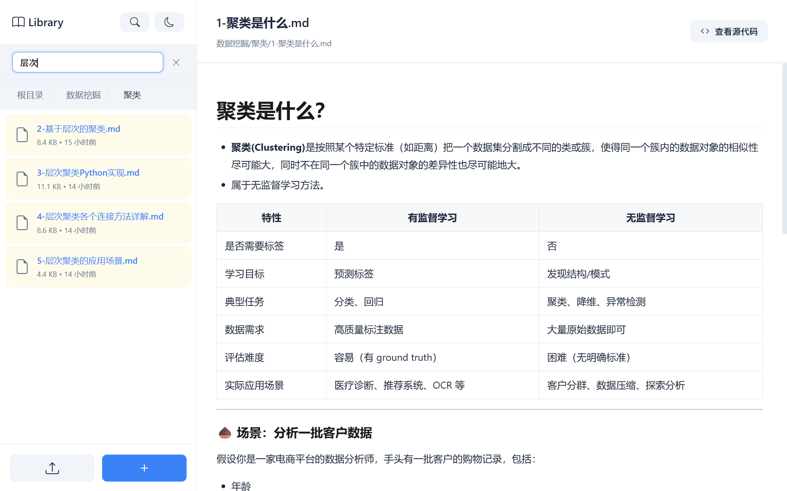
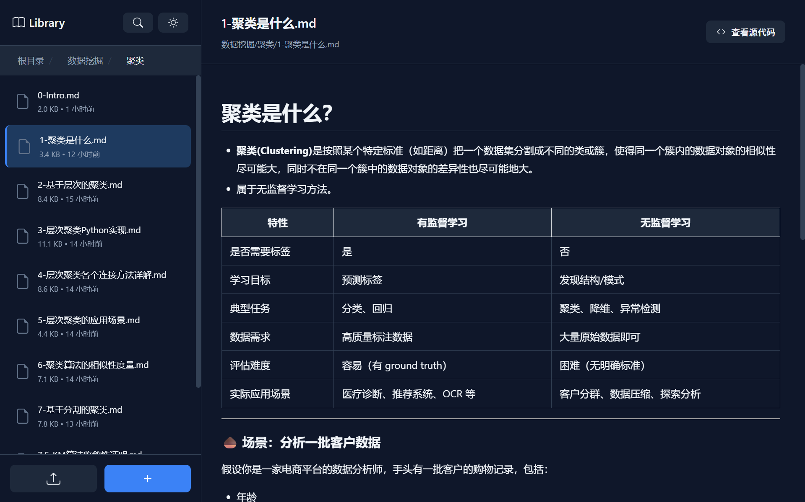

# MarkiNote ✨

<div align="center">

</div>

<div align="center">
  
[English](README.en.md) | [简体中文](README.md) | [日本語](README.ja.md) | [한국어](README.ko.md)

**A powerful and completely free Markdown document management and preview system** (｡･ω･｡)ﾉ♡

[Preview](https://www.google.com/search?q=%23-product-preview) • [Quick Start](https://www.google.com/search?q=%23-quick-start) • [Features](https://www.google.com/search?q=%23-features) • [User Guide](https://www.google.com/search?q=%23-user-guide) • [Contribute](https://www.google.com/search?q=%23-contribution)

</div>

---

## ✨ Introduction

MarkiNote is a modern Markdown document management system based on Flask, making managing your Markdown documents simple and fun! (★ ω ★)

### Why Choose MarkiNote?

* 📝 **Real-time Preview**: WYSIWYG (What You See Is What You Get) Markdown rendering
* 📚 **Document Management**: Manage your Markdown docs just like in a file manager
* 🎨 **Math Formulas**: Perfect support for LaTeX math rendering
* 🌈 **Beautiful Interface**: Modern UI design for a super smooth experience
* 🚀 **Lightweight & Fast**: Based on Flask, starts fast with low resource usage

---

## 🎯 Features

### 📂 File Management

* ✅ Upload single files or entire folders
* ✅ Create, delete, move, and edit files and folders
* ✅ Breadcrumb navigation for easy file structure browsing
* ✅ Right-click context menu for quick operations

### 📝 Markdown Preview

* ✅ Real-time Markdown document rendering
* ✅ Supports GFM (GitHub Flavored Markdown)
* ✅ Code syntax highlighting
* ✅ Complete support for tables, lists, blockquotes, etc.
* ✅ Math formula rendering (MathJax)
* ✅ View and edit Markdown source code
* ✅ Mermaid chart support

---

## 📸 Product Preview

**Check out what MarkiNote looks like! Every interface is full of love~** ✨

<div align="center">

<p><em>Content browsing and file management—everything you need with a silky smooth feel</em></p>
</div>

<div align="center">

<p><em>Supports LaTeX math formulas and code block rendering</em></p>
</div>

<div align="center">

<p><em>Supports rendering of various Mermaid charts</em></p>
</div>

<div align="center">

<p><em>Too many files? No worries with one-click keyword search!</em></p>
</div>

<div align="center">

<p><em>Want to burn the midnight oil? Switch to Night Mode~</em></p>
</div>

<div align="center">

<p><em>View and edit file source code with one click—super efficient!</em></p>
</div>

---

## 🚀 Quick Start

### Requirements

* Python 3.8 or higher
* pip package manager

### Installation Steps

1️⃣ **Clone the Project**

```bash
git clone https://github.com/wink-wink-wink555/MarkiNote.git
cd MarkiNote

```

2️⃣ **Install Dependencies**

```bash
pip install -r requirements.txt

```

3️⃣ **Download Frontend Libraries**

The project uses localized frontend libraries (MathJax, Mermaid, html2canvas), which are included in the `static/libs/` directory. If you need to update them, run:

```bash
# Windows PowerShell
Invoke-WebRequest -Uri "https://unpkg.com/mathjax@3.2.2/es5/tex-mml-chtml.js" -OutFile "static/libs/tex-mml-chtml.js"
Invoke-WebRequest -Uri "https://unpkg.com/mermaid@10/dist/mermaid.min.js" -OutFile "static/libs/mermaid.min.js"
Invoke-WebRequest -Uri "https://unpkg.com/html2canvas@1.4.1/dist/html2canvas.min.js" -OutFile "static/libs/html2canvas.min.js"

# Linux/Mac
curl -L -o static/libs/tex-mml-chtml.js "https://unpkg.com/mathjax@3.2.2/es5/tex-mml-chtml.js"
curl -L -o static/libs/mermaid.min.js "https://unpkg.com/mermaid@10/dist/mermaid.min.js"
curl -L -o static/libs/html2canvas.min.js "https://unpkg.com/html2canvas@1.4.1/dist/html2canvas.min.js"

```

4️⃣ **Start the Application**

```bash
python main.py

```

5️⃣ **Open Browser**

Visit `http://localhost:5000` to start using it! ヾ(≧▽≦*)o

---

## 📖 User Guide

### Basic Operations

1. **Upload Files** (｡･ω･｡)ﾉ♡
* Click the "Upload" button in the sidebar
* Select files or folders to upload
* Supports `.md`, `.markdown`, and `.txt` formats


2. **Preview Documents** ✨
* Click on a file in the left file list
* The right side will display the rendered content in real-time
* Click "View Source Code" to see the raw Markdown


3. **Manage Files** 📁
* Right-click on a file/folder to open the menu
* You can preview, move, or delete files
* Use the "New Folder" button to create directories


### Advanced Features

* **Math Formulas**: Supports inline formulas `$...$` and block formulas `$$...$$`
* **Code Highlighting**: Use ````language` to start a code block
* **Mermaid Charts**: Supports flowcharts, sequence diagrams, and more visualizations

For more detailed instructions, please check [lib/新手指南.md](https://www.google.com/search?q=lib/%E6%96%B0%E6%89%8B%E6%8C%87%E5%8D%97.md) (｡♥‿♥｡)

---

## 📁 Project Structure

```
MarkiNote/
├── app/                   # Flask App Core
│   ├── __init__.py        # App Initialization
│   ├── config.py          # Configuration
│   ├── routes/            # Route Modules
│   │   ├── main_routes.py    # Main Routes
│   │   └── library_routes.py # File Management Routes
│   └── utils/             # Utility Functions
│       ├── file_utils.py     # File Processing
│       └── markdown_utils.py # Markdown Rendering
├── static/                # Static Assets
│   ├── libs/              # Frontend Libraries (Localized)
│   │   ├── tex-mml-chtml.js      # MathJax
│   │   ├── mermaid.min.js        # Mermaid
│   │   └── html2canvas.min.js    # html2canvas
│   ├── style.css          # Stylesheet
│   └── script.js          # Frontend Script
├── templates/             # HTML Templates
│   └── index.html
├── lib/                   # Document Library (Stores Markdown files)
├── main.py                # App Entry Point
├── requirements.txt       # Dependency List
└── README.md              # Project Documentation

```

---

## 🛠️ Tech Stack

### Backend

* **Flask 3.0.0** - Web Framework
* **markdown** - Markdown Parsing
* **BeautifulSoup4** - HTML Processing
* **Pygments** - Code Syntax Highlighting

### Frontend

* **Vanilla JavaScript** - Native JS, no framework dependencies
* **MathJax 3** - Math Formula Rendering
* **Mermaid** - Chart Rendering
* **html2canvas** - Screenshot Functionality

---

## 🤝 Contribution

Contributions of all forms are welcome! (ﾉ◕ヮ◕)ﾉ*:･ﾟ✧

### How to Contribute

1. Fork this project
2. Create your feature branch (`git checkout -b feature/AmazingFeature`)
3. Commit your changes (`git commit -m 'Add some AmazingFeature'`)
4. Push to the branch (`git push origin feature/AmazingFeature`)
5. Open a Pull Request

### Reporting Issues

If you find a bug or have feature suggestions, please let us know in [Issues](https://github.com/wink-wink-wink555/MarkiNote/issues)!

---

## 📄 License

This project is licensed under the MIT License - see the [LICENSE](https://www.google.com/search?q=LICENSE) file for details.

---

## 💖 Acknowledgments

Thanks to all the developers who contributed to this project! (づ｡◕‿‿◕｡)づ

Special thanks to the following open-source projects:

* [Flask](https://flask.palletsprojects.com/)
* [MathJax](https://www.mathjax.org/)
* [Mermaid](https://mermaid.js.org/)

---

<div align="center">

<p><strong>Made with ❤️ by <a href="https://github.com/wink-wink-wink555">wink-wink-wink555</a></strong></p>

<p>If this project helps you, please give it a ⭐️ to show your support! (◕‿◕✿)</p>


</div>
