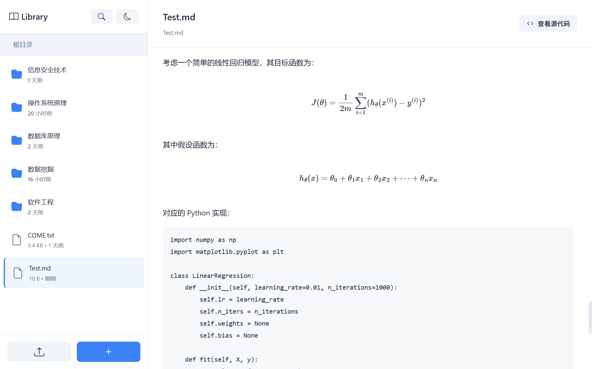

# MarkiNote ✨

<div align="center">

</div>

<div align="center">

[English](README.en.md) | [简体中文](README.md) | [日本語](README.ja.md) | [한국어](README.ko.md)


[](https://www.python.org/)
[](https://flask.palletsprojects.com/)
[](LICENSE)

**강력하면서도 완전 무료인 Markdown 문서 관리 및 미리보기 시스템** (｡･ω･｡)ﾉ♡

[제품 미리보기](#-제품 미리보기) • [빠른 시작](#-빠른 시작) • [사용 가이드](#-사용 가이드) • [기여하기](#-기여하기)

</div>

---

## ✨ 프로젝트 소개

MarkiNote는 Flask 기반의 현대적인 Markdown 문서 관리 시스템입니다. 여러분의 Markdown 문서 관리를 쉽고 재미있게 만들어 드릴게요! (★ ω ★)

### 왜 MarkiNote를 선택해야 할까요?

* 📝 **실시간 미리보기**: '보는 대로 출력되는' 위지윅(WYSIWYG) 방식의 Markdown 렌더링
* 📚 **문서 관리**: 파일 관리자처럼 익숙하고 편리한 Markdown 문서 관리
* 🎨 **수학 공식**: LaTeX 수학 공식 렌더링 완벽 지원
* 🌈 **아름다운 UI**: 세련된 UI 디자인으로 즐거운 사용자 경험 선사
* 🚀 **가볍고 빠른 속도**: Flask 기반으로 빠른 실행과 적은 리소스 소모

---

## 🎯 주요 기능

### 📂 파일 관리

* ✅ 개별 파일 또는 폴더 전체 업로드 지원
* ✅ 파일 및 폴더 생성, 삭제, 이동, 편집 기능
* ✅ 브레드크럼(Breadcrumb) 내비게이션으로 쉬운 구조 파악
* ✅ 우클릭 메뉴를 통한 빠른 작업 수행

### 📝 Markdown 미리보기

* ✅ 실시간 Markdown 문서 렌더링
* ✅ GFM (GitHub Flavored Markdown) 지원
* ✅ 코드 하이라이팅 기능
* ✅ 표(Table), 리스트, 인용구 등 완벽 지원
* ✅ 수학 공식 렌더링 (MathJax)
* ✅ Markdown 소스 코드 확인 및 편집 기능
* ✅ Mermaid 차트 지원

---

## 📸 제품 미리보기

**MarkiNote의 실제 모습을 확인해 보세요! 모든 화면에 정성을 가득 담았답니다~** ✨

<div align="center">

<p><em>콘텐츠 탐색부터 파일 관리까지, 부드러운 조작감을 느껴보세요</em></p>
</div>

<div align="center">

<p><em>LaTeX 수학 공식과 코드 블록 렌더링을 지원합니다</em></p>
</div>

<div align="center">

<p><em>다양한 Mermaid 차트 렌더링을 지원합니다</em></p>
</div>

<div align="center">

<p><em>파일이 너무 많나요? 키워드 검색 한 번이면 고민 해결!</em></p>
</div>

<div align="center">

<p><em>밤늦게 집중하고 싶을 땐? 야간 모드(Dark Mode)로 전환해 보세요~</em></p>
</div>

<div align="center">

<p><em>소스 코드 확인과 편집도 클릭 한 번으로! 효율이 팍팍 올라가요!</em></p>
</div>

---

## 🚀 빠른 시작

### 환경 요구 사항

* Python 3.8 이상 버전
* pip 패키지 관리자

### 설치 단계

1️⃣ **프로젝트 클론(Clone)**

```bash
git clone https://github.com/wink-wink-wink555/MarkiNote.git
cd MarkiNote

```

2️⃣ **의존성 라이브러리 설치**

```bash
pip install -r requirements.txt

```

3️⃣ **프론트엔드 리소스 다운로드**

본 프로젝트는 로컬 프론트엔드 라이브러리(MathJax, Mermaid, html2canvas)를 사용하며, 이미 `static/libs/` 디렉토리에 포함되어 있습니다. 업데이트가 필요한 경우 다음 명령어를 실행하세요:

```bash
# Windows PowerShell
Invoke-WebRequest -Uri "https://unpkg.com/mathjax@3.2.2/es5/tex-mml-chtml.js" -OutFile "static/libs/tex-mml-chtml.js"
Invoke-WebRequest -Uri "https://unpkg.com/mermaid@10/dist/mermaid.min.js" -OutFile "static/libs/mermaid.min.js"
Invoke-WebRequest -Uri "https://unpkg.com/html2canvas@1.4.1/dist/html2canvas.min.js" -OutFile "static/libs/html2canvas.min.js"

# Linux/Mac
curl -L -o static/libs/tex-mml-chtml.js "https://unpkg.com/mathjax@3.2.2/es5/tex-mml-chtml.js"
curl -L -o static/libs/mermaid.min.js "https://unpkg.com/mermaid@10/dist/mermaid.min.js"
curl -L -o static/libs/html2canvas.min.js "https://unpkg.com/html2canvas@1.4.1/dist/html2canvas.min.js"

```

4️⃣ **애플리케이션 실행**

```bash
python main.py

```

5️⃣ **브라우저 접속**

`http://localhost:5000`에 접속하면 바로 시작할 수 있어요! ヾ(≧▽≦*)o

---

## 📖 사용 가이드

### 기초 조작

1. **파일 업로드** (｡･ω･｡)ﾉ♡
* 사이드바의 "업로드" 버튼을 클릭합니다.
* 업로드할 파일이나 폴더를 선택합니다.
* `.md`, `.markdown`, `.txt` 형식을 지원합니다.


2. **문서 미리보기** ✨
* 왼쪽 파일 목록에서 파일을 클릭합니다.
* 오른쪽에 실시간으로 렌더링된 내용이 표시됩니다.
* "소스 코드 보기"를 클릭하여 원본 Markdown을 확인할 수 있습니다.


3. **파일 관리** 📁
* 파일/폴더를 우클릭하여 메뉴를 엽니다.
* 미리보기, 이동, 삭제 등의 작업을 할 수 있습니다.
* "새 폴더" 버튼을 사용하여 폴더를 생성합니다.


### 고급 기능

* **수학 공식**: 인라인 공식 `$ ... $` 과 블록 공식 `$$...$$` 을 지원합니다.
* **코드 하이라이팅**: ````언어명` 구문으로 코드 블록을 생성하세요.
* **Mermaid 차트**: 플로우차트, 시퀀스 다이어그램 등 시각화 도구를 지원합니다.

더 자세한 사용 설명은 [lib/新手指南.md](lib/新手指南.md) (가이드 문서)를 확인해 주세요! (｡♥‿♥｡)

---

## 📁 프로젝트 구조

```
MarkiNote/
├── app/                    # Flask 애플리케이션 코어
│   ├── __init__.py         # 앱 초기화
│   ├── config.py           # 설정 파일
│   ├── routes/             # 라우팅 모듈
│   │   ├── main_routes.py    # 메인 라우트
│   │   └── library_routes.py # 파일 관리 라우트
│   └── utils/              # 유틸리티 함수
│       ├── file_utils.py     # 파일 처리
│       └── markdown_utils.py # Markdown 렌더링
├── static/                 # 정적 리소스
│   ├── libs/               # 프론트엔드 라이브러리(로컬)
│   │   ├── tex-mml-chtml.js      # MathJax
│   │   ├── mermaid.min.js        # Mermaid
│   │   └── html2canvas.min.js    # html2canvas
│   ├── style.css           # 스타일 시트
│   └── script.js           # 프론트엔드 스크립트
├── templates/              # HTML 템플릿
│   └── index.html
├── lib/                    # 문서 라이브러리 (Markdown 파일 저장소)
├── main.py                 # 앱 실행 엔트리 포인트
├── requirements.txt        # 의존성 목록
└── README.md               # 프로젝트 설명서

```

---

## 🛠️ 기술 스택

### 백엔드

* **Flask 3.0.0** - 웹 프레임워크
* **markdown** - Markdown 파싱
* **BeautifulSoup4** - HTML 처리
* **Pygments** - 코드 문법 하이라이팅

### 프론트엔드

* **Vanilla JavaScript** - 외부 프레임워크 의존성 없는 순수 JS
* **MathJax 3** - 수학 공식 렌더링
* **Mermaid** - 차트 및 다이어그램 렌더링
* **html2canvas** - 스크린샷 캡처 기능

---

## 🤝 기여하기

모든 형태의 기여를 환영합니다! (ﾉ◕ヮ◕)ﾉ*:･ﾟ✧

### 기여 방법

1. 프로젝트를 Fork 합니다.
2. 기능 구현을 위한 브랜치를 생성합니다 (`git checkout -b feature/AmazingFeature`).
3. 변경 사항을 커밋합니다 (`git commit -m 'Add some AmazingFeature'`).
4. 브랜치에 푸시합니다 (`git push origin feature/AmazingFeature`).
5. Pull Request를 생성합니다.

### 버그 리포트

버그를 발견했거나 기능 제안이 있다면 [Issues](https://github.com/wink-wink-wink555/MarkiNote/issues)를 통해 알려주세요!

---

## 📄 라이선스

본 프로젝트는 MIT 라이선스를 따릅니다. 자세한 내용은 [LICENSE](LICENSE) 파일을 확인하세요.

---

## 💖 감사 인사

이 프로젝트에 기여해주신 모든 개발자분들께 감사드립니다! (づ｡◕‿‿◕｡)づ

특별히 다음 오픈소스 프로젝트에 감사드립니다:

* [Flask](https://flask.palletsprojects.com/)
* [MathJax](https://www.mathjax.org/)
* [Mermaid](https://mermaid.js.org/)

---

<div align="center">

<p><strong>Made with ❤️ by <a href="https://github.com/wink-wink-wink555">wink-wink-wink555</a></strong></p>

<p>이 프로젝트가 도움이 되었다면 ⭐️ 별 하나로 응원해 주세요! (◕‿◕✿)</p>


</div>

