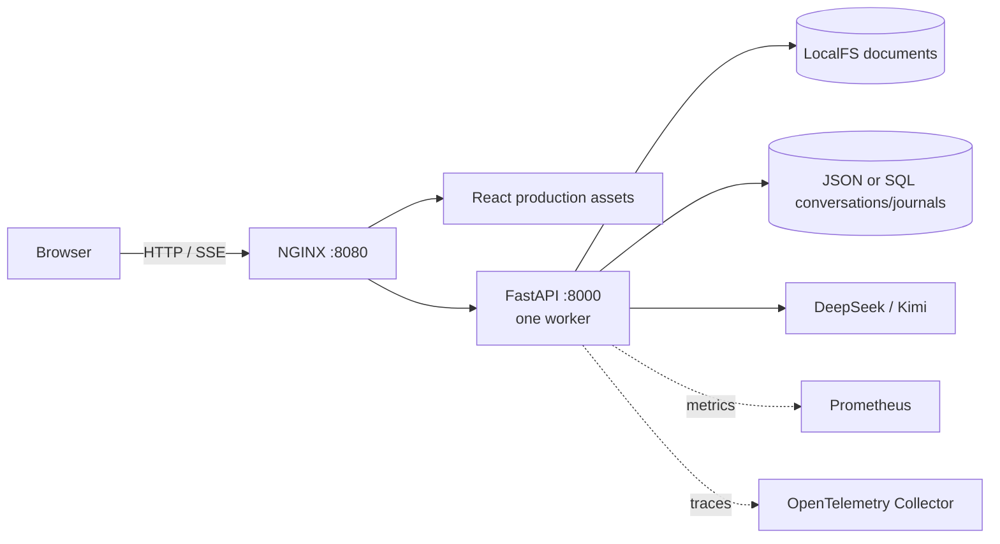

# MarkiNote ✨

<div align="center">

**A self-hosted Markdown workspace with a guarded AI agent.**

[](#project-status)
[](https://www.python.org/)
[](https://react.dev/)
[](https://github.com/wink-wink-wink555/MarkiNote/actions/workflows/ci.yml)
[](LICENSE)

[简体中文](README_CN.md) · [Quick start](#docker-quick-start) · [Features](#implemented-features) · [AI agent](#ai-agent) · [Operations](#production-deployment) · [Contributing](CONTRIBUTING.md)

</div>

---

## ✨ Overview

MarkiNote turns a directory of Markdown files into a browser-based writing, reading, and AI-assisted knowledge workspace. The current full edition combines a React 19 and TypeScript client, a FastAPI modular monolith, a generated OpenAPI client, and an NGINX same-origin gateway. Optional Compose profiles add PostgreSQL, Prometheus, and OpenTelemetry.

The AI assistant is an agent rather than a chat-only sidebar: it can inspect the library, search content, create and edit documents, organize folders, fetch public web pages, and roll back one selected file operation. Mutating tools are deliberately guarded by opt-in write access, resource selection, one-time approvals, bounded input, before-images, and an operation journal.

<a id="project-status"></a>

> [!IMPORTANT]
> **MarkiNote 4.0.0 is Beta software.** It is suitable for open-source review, single-machine self-hosted evaluation, and feedback. It is not yet a stable production release, a multi-user account system, or a highly available service. Read [Known limitations](#known-limitations) before exposing it beyond a trusted machine.

The original Flask-based lightweight edition is preserved on the [`lite`](https://github.com/wink-wink-wink555/MarkiNote/tree/lite) branch. The `main` branch contains this full React/FastAPI/Docker edition.

### At a glance

| Area | Current implementation |
|---|---|
| Web | React 19, TypeScript, Vite, CodeMirror 6, TanStack Query |
| API | Python 3.12, FastAPI, Pydantic, SQLAlchemy, Alembic |
| Entry point | NGINX serves the SPA and proxies same-origin HTTP/SSE traffic |
| Documents | Markdown, Markdown-compatible text, and plain text on LocalFS |
| Conversations | JSON by default; optional SQLite/PostgreSQL repository adapter |
| AI | DeepSeek and Kimi allowlists, streaming SSE, 11 bounded tools |
| Operations | Docker Compose, optional metrics/tracing/database profiles, hardened production overlay |
| Intended topology | Single tenant, one API container, one Uvicorn worker, one document writer |

<a id="implemented-features"></a>

## 🔗 Project Integration: FinNote Intelligent Financial Document System

MarkiNote has been integrated with [FinanceMCP](https://github.com/guangxiangdebizi/FinanceMCP) to form **FinNote**, an intelligent financial document system designed for financial research, AI-assisted analysis, and long-term knowledge preservation. The project participated in the Shanghai Collegiate Computer Application Ability Competition and received a Second Prize.

🌐 **Live Demo: [https://finvestai.top/](https://finvestai.top/)**

Within the FinNote architecture, [FinanceMCP](https://github.com/guangxiangdebizi/FinanceMCP) serves as the financial data and tool service layer. Built with Node.js, Express, and the Model Context Protocol (MCP) SDK, it exposes 19 standardized MCP tools that provide AI agents with access to stocks, funds, bonds, macroeconomic data, financial news, technical indicators, and multi-market financial data.

MarkiNote serves as the **AI Agent-powered document and knowledge management application layer**. It receives and organizes users' natural-language tasks, presents financial data and model-generated analysis inside an editable Markdown workspace, and turns the resulting analysis into manageable, traceable, and reusable document assets.

In the FinNote use case, the two systems collaborate through an HTTP / MCP service workflow:

**Natural-language request → AI Agent task understanding → FinanceMCP tool invocation → Financial data retrieval → AI-assisted analysis → Markdown document generation and preservation → Continuous editing and knowledge management**

As a result, MarkiNote can be used not only as a general-purpose self-hosted Markdown workspace and AI Agent document operating system, but also as the intelligent research workspace of FinNote, connecting real-time financial data, AI analysis, and long-term document asset management within a unified workflow.

## 🎯 Implemented features

| Capability | What is implemented | Current boundary |
|---|---|---|
| Library | Tree browsing, filename/path filtering, upload, create, save, move, rename, and recoverable delete | The Web UI does not yet list or restore trash; the API does |
| Editor | CodeMirror 6, source/preview/split modes, search, keyboard editing, and download | Documents and previews are bounded by configured size limits |
| Rendering | Sanitized Markdown, fenced code, syntax highlighting, Mermaid, KaTeX, and theme-aware output | Unsafe HTML is removed; rendering is not a general-purpose HTML host |
| Reliability | Dirty-buffer protection, external-change detection, content versions, ETags, and conflict UI | Third-party clients may omit a write precondition and perform a blind update |
| Internationalization | Chinese, English, French, and Japanese UI; light/dark themes; responsive desktop/mobile layouts | Product documentation is maintained in English and Simplified Chinese |
| AI chat | Versioned streaming events, conversation history, cancellation, current-document context, and attachments | Real provider availability depends on the account, region, balance, and network |
| AI actions | 11 tools, write opt-in, per-resource authorization, exact one-time approvals, before-images, audit records, and single-operation rollback | There is no atomic whole-group rollback across multiple files |
| Platform | RFC 9457-style errors, request IDs, liveness/readiness, Prometheus metrics, optional OpenTelemetry, deterministic OpenAPI generation | Readiness is a basic runtime check, not a complete provider/data/disaster-recovery proof |

Sidebar search filters names and paths. Full-text document search is available to the agent through `search_files`.

<a id="docker-quick-start"></a>

## 🚀 Docker quick start

### Requirements

- Docker Desktop or Docker Engine
- Docker Compose v2 (v2.24 or newer is recommended)
- About 2 GB of free memory for the default stack; optional profiles need more

### 1. Prepare configuration

PowerShell:

```powershell
Copy-Item .env.example .env
docker compose config --quiet
```

Bash:

```bash
cp .env.example .env
docker compose config --quiet
```

The checked-in defaults bind the gateway to `127.0.0.1:8080`. A loopback-only evaluation may leave `MARKINOTE_ACCESS_TOKEN` empty. Before binding to another interface, configure access security as described in [Production deployment](#production-deployment).

### 2. Build and start

```bash
docker compose up -d --build --wait
```

Open <http://127.0.0.1:8080>. Useful checks:

```bash
docker compose ps
docker compose logs -f --tail=200 api gateway
curl --fail http://127.0.0.1:8080/gateway-health
curl --fail http://127.0.0.1:8080/health/live
curl --fail http://127.0.0.1:8080/health/ready
```

PowerShell users can replace the three `curl` calls with `Invoke-RestMethod`.

`gateway-health` proves only that NGINX is serving. `health/live` proves that the API process is alive. `health/ready` additionally checks the four writable data directories and, when the database backend is active, its schema revision; it still does not validate every record, provider, or restore path.

### 3. Stop or update safely

```bash
# Preserve containers, named volumes, and the Docker Desktop start button.
docker compose stop

# Rebuild after pulling a code update.
docker compose up -d --build --wait

# Remove containers and networks, but preserve named volumes.
docker compose down
```

> [!CAUTION]
> `docker compose down -v` deletes the named data volumes. Do not use it as a routine stop or upgrade command.

<details><summary><strong>First-use walkthrough</strong></summary>

1. Create or upload a `.md`, `.markdown`, or `.txt` document from the library sidebar.
2. Switch between Source, Preview, and Split modes. Mermaid and KaTeX are rendered in Preview.
3. Open the AI panel, select a provider/model, and enter a transient provider key or use a server-managed key.
4. Attach selected library documents or use the currently open document as context.
5. Keep **Allow write tools** disabled for read-only help. Enable it only when an agent must change files.
6. Review each requested resource or external-content mutation. Approvals are bound to the exact tool arguments and are consumed once.
7. If a completed AI file operation should be reversed, choose its explicit operation index from the tool card.

</details>

## 💾 Data, persistence, and import

The default Compose stack stores application data in named volumes. It does **not** bind-mount the repository's `lib` directory.

| Volume | Container path | Purpose |
|---|---|---|
| `${MARKINOTE_VOLUME_PREFIX}_library` | `/data/library` | Markdown document source of truth |
| `${MARKINOTE_VOLUME_PREFIX}_conversations` | `/data/conversations` | Default JSON conversations |
| `${MARKINOTE_VOLUME_PREFIX}_backups` | `/data/backups` | AI before-images, journals, and recovery state |
| `${MARKINOTE_VOLUME_PREFIX}_trash` | `/data/trash` | Recoverably deleted documents |
| `${MARKINOTE_VOLUME_PREFIX}_state` | `/data/state` | Reserved/default database state path |

To import local Markdown files from `lib` on Windows after the stack is running:

```powershell
powershell.exe -NoProfile -ExecutionPolicy Bypass -File .\scripts\import-library.ps1 -Source .\lib
```

The importer accepts `.md`, `.markdown`, and `.txt`, checks paths and name conflicts before upload, and never makes the repository directory the live data source. A server failure can still leave a batch partially imported; back up first and reconcile completed items from the command output.

<details><summary><strong>Storage and concurrency model</strong></summary>

- Markdown bodies always remain on LocalFS, including when the PostgreSQL profile is enabled.
- Writes use path validation, quotas, atomic replacement, content versions, and process-local resource locks.
- The supported topology is exactly one API writer. Do not add Uvicorn workers or API replicas merely because PostgreSQL is enabled.
- The default `MARKINOTE_CONVERSATION_BACKEND=json` stores conversations and journals as JSON. The configured database URL is not opened in this profile.
- `MARKINOTE_CONVERSATION_BACKEND=database` activates SQLAlchemy storage for conversations, operation journals, and agent-run journals. It may target SQLite for local work or PostgreSQL for the optional profile.
- Redis is reserved infrastructure. It is not a cache, queue, lock service, or core request dependency in this release.

</details>

<a id="ai-agent"></a>

## 🤖 AI agent

### Available tools

| Type | Tools | Purpose |
|---|---|---|
| Read | `read_file`, `list_directory`, `search_files` | Inspect selected documents, browse folders, and search document bodies |
| Write | `write_file`, `edit_file`, `create_file`, `create_folder`, `delete_item`, `move_item` | Create, update, organize, or recoverably delete library items |
| Web | `web_search`, `fetch_url` | Search public pages and fetch a validated public HTTP(S) URL |

Agent runs are capped at eight tool rounds and 24 total tool calls. Agent file tools use a 512 KiB file limit even though regular documents may reach 2 MiB; `fetch_url` accepts at most 2 MiB and considers at most 20,000 extracted characters for an additional long-page summary call. File mutations are journaled, backed up before the change, and exposed as tool cards. Rollback always targets one explicit operation index; the API does not pretend that a multi-file group can be reversed atomically.

### Reviewed provider allowlist

As of **2026-08-09**, the repository allowlist is:

| Provider | API endpoint | Models |
|---|---|---|
| DeepSeek | `https://api.deepseek.com` | `deepseek-v4-flash` (default), `deepseek-v4-pro` |
| Kimi / Moonshot China | `https://api.moonshot.cn/v1` | `kimi-k2.6` |

These models are called with thinking disabled to keep the current multi-step tool protocol consistent. Key validation intersects the provider's `/models` response with the local capability-reviewed allowlist; an arbitrary remote model is never enabled automatically. Provider availability, prices, regional policy, and model IDs can change—verify them in the [DeepSeek documentation](https://api-docs.deepseek.com/updates/) and [Kimi documentation](https://platform.kimi.com/docs/models).

### Keys, privacy, and approvals

- A key entered in the Web UI lives only in the current page's memory. Legacy MarkiNote local-storage key entries are removed, and a refresh or close clears the in-memory value.
- Provider/model preferences may persist, but the key does not. `MARKINOTE_AI_API_KEY` is one optional global server-side fallback, so it must match the selected provider. In the current Compose baseline it is an environment variable visible to Docker host/container administrators; production operators should inject it through an external secret manager or leave it empty.
- Messages, selected documents, attachments, and fetched-page summaries are sent to the chosen external provider. Do not submit content that the provider is not authorized to process.
- Long-page summarization and optional automatic title generation make additional provider requests and may incur additional cost.
- AI write access starts **off** for new and restored conversations.
- Unselected resources require approval. After `web_search` or `fetch_url`, any mutation requires a new one-time approval for the exact tool name and canonical arguments, treating web content as untrusted instructions.
- `fetch_url` rejects credentials in URLs, private/link-local destinations, unsafe redirect hops, and DNS/peer mismatches. `web_search` remains best-effort scraping of public search pages, not a guaranteed official search API.
- Fake-provider tests verify protocol behavior only. They do not prove a real account, balance, region, model, or network path.

## 🏗️ Architecture


```mermaid
flowchart LR
    User[Browser] -->|HTTP / SSE| Gateway[NGINX :8080]
    Gateway --> Web[React production assets]
    Gateway --> API[FastAPI :8000<br/>one worker]
    API --> Library[(LocalFS documents)]
    API --> State[(JSON or SQL conversations/journals)]
    API --> Providers[DeepSeek / Kimi]
    API -. metrics .-> Prometheus
    API -. traces .-> OTel[OpenTelemetry Collector]
```

MarkiNote is a modular monolith, not a microservice estate. HTTP adapters call application/domain services, which depend on explicit storage/provider ports. The browser consumes a TypeScript client generated from FastAPI's OpenAPI schema. Agent replies use versioned SSE envelopes, while regular API failures use Problem Details with a stable error code and request ID.

### Compose profiles

| Profile | Services | Intended use |
|---|---|---|
| default | `gateway`, `api` | Local evaluation with JSON conversation storage |
| `postgres` + `migration` | PostgreSQL and one-shot Alembic migration | Exercise the SQL conversation/journal adapter |
| `observability` | OpenTelemetry Collector and Prometheus | Local traces, metrics, and alert rehearsal |
| `redis` | Redis only | Reserved future infrastructure; unused by the core path |
| production overlay | Digest-only API/gateway images and fail-closed settings | Single-instance deployment behind a TLS ingress |

<details><summary><strong>PostgreSQL profile</strong></summary>

Starting a profile alone does not switch the application to PostgreSQL. First set a non-example password and an encoded connection URL in `.env`:

```dotenv
MARKINOTE_CONVERSATION_BACKEND=database
MARKINOTE_POSTGRES_DB=markinote
MARKINOTE_POSTGRES_USER=markinote
MARKINOTE_POSTGRES_PASSWORD=<strong-random-password>
MARKINOTE_DATABASE_URL=postgresql+psycopg://markinote:<url-encoded-password>@postgres:5432/markinote
MARKINOTE_AUTO_CREATE_DATABASE=false
```

Then start the database, migrate it, and start the application:

```bash
docker compose --profile postgres up -d --wait postgres
docker compose --profile migration run --rm --no-deps migrate
docker compose --profile postgres up -d --build --wait
```

PostgreSQL replaces conversation and journal persistence only. Document bodies still live in the single-writer library volume.

Existing JSON conversations are not migrated merely by changing the backend. `apps/api/scripts/migrate_conversations.py` is dry-run by default and migrates conversation data only—not legacy command or agent-run journals. Freeze writes, bring Alembic to head, review its bounded report, and only then rerun with `--apply`.

</details>

<details><summary><strong>Observability profile</strong></summary>

Enable tracing if required, then start the profile:

```dotenv
MARKINOTE_OTEL_ENABLED=true
MARKINOTE_OTEL_ENDPOINT=http://otel-collector:4318/v1/traces
MARKINOTE_OTEL_SERVICE_NAME=markinote-api
```

```bash
docker compose --profile observability up -d --wait
curl --fail http://127.0.0.1:9090/-/ready
```

Prometheus is loopback-bound by default. Application metrics use bounded server-defined labels; paths, document names, IDs, provider model names, prompts, credentials, and tool arguments must not become labels or trace attributes.

</details>

## ⚙️ Configuration reference

Copy `.env.example` to `.env` for Compose. Pydantic also reads `.env.local` for native API development. The following are the settings most operators need to understand.

### Access and runtime

| Variable | Local default | Meaning |
|---|---:|---|
| `MARKINOTE_HTTP_BIND` | `127.0.0.1` | Host interface published by the gateway |
| `MARKINOTE_HTTP_PORT` | `8080` | Host gateway port |
| `MARKINOTE_ENVIRONMENT` | `development` | `development`, `test`, or fail-closed `production` validation |
| `MARKINOTE_ACCESS_TOKEN` | empty | Single-tenant deployment token; required outside trusted loopback use |
| `MARKINOTE_SECRET_KEY` | empty | Signs the 8-hour HttpOnly access cookie; must differ from the token |
| `MARKINOTE_PUBLIC_ORIGIN` | empty | Canonical HTTPS origin required in production |
| `MARKINOTE_TRUSTED_HOSTS` | loopback, `testserver`, `api` | JSON array of hostnames; no schemes, paths, or ports |
| `MARKINOTE_TRUSTED_ORIGINS` | `[]` | Additional accepted write-request origins; this is not a CORS switch |
| `MARKINOTE_LOG_LEVEL` | `INFO` | API log level |
| `MARKINOTE_JSON_LOGS` | `true` | Structured logs |
| `MARKINOTE_METRICS_ENABLED` | `true` | Prometheus metrics endpoint |

### Storage and retention

| Variable | Compose default | Meaning |
|---|---:|---|
| `MARKINOTE_VOLUME_PREFIX` | `markinote` | Prefix for named volumes |
| `MARKINOTE_CONVERSATION_BACKEND` | `json` | `json` or `database` repository |
| `MARKINOTE_DATABASE_URL` | SQLite path | Used only when the database backend is active |
| `MARKINOTE_AUTO_CREATE_DATABASE` | `true` locally | Convenience for local Compose; native Settings default and production overlay are `false` |
| `MARKINOTE_MAX_REQUEST_BYTES` | 16 MiB | Whole request limit |
| `MARKINOTE_MAX_DOCUMENT_BYTES` | 2 MiB | Individual document limit |
| `MARKINOTE_MAX_PREVIEW_BYTES` | 2 MiB | Server preview limit |
| `MARKINOTE_MAX_LIBRARY_BYTES` | 1 GiB | Live document library quota |
| `MARKINOTE_TRASH_MAX_ITEMS` | 500 | Retained trash item count |
| `MARKINOTE_TRASH_MAX_BYTES` | 1 GiB | Trash byte budget |
| `MARKINOTE_BACKUP_MAX_GROUPS` | 100 | Normal AI backup group count |
| `MARKINOTE_BACKUP_MAX_BYTES` | 256 MiB | Normal AI backup byte budget; see the Saga limitation below |

### AI and operational controls

| Variable | Compose default | Meaning |
|---|---:|---|
| `MARKINOTE_AI_API_KEY` | empty | Optional single server-side provider credential |
| `MARKINOTE_AI_GENERATE_TITLES` | `false` | Adds a provider request when automatic conversation titles are enabled |
| `MARKINOTE_AGENT_RUN_RECONCILE_ON_STARTUP` | `false` | Production overlay enables bounded stale-run reconciliation |
| `MARKINOTE_AGENT_RUN_SINGLE_WRITER` | `false` | Required acknowledgement before startup reconciliation may run |
| `MARKINOTE_AGENT_RUN_RECONCILE_LIMIT` | `1000` | One startup batch; valid range 1–10,000 |
| `MARKINOTE_OTEL_ENABLED` | `false` | Enables API tracing; starting the profile alone does not |
| `MARKINOTE_OTEL_ENDPOINT` | collector HTTP endpoint | OTLP/HTTP trace destination |
| `MARKINOTE_OTEL_SERVICE_NAME` | `markinote-api` | Bounded service identity |

<details><summary><strong>AI stream limits and fixed request bounds</strong></summary>

The example environment exposes positive, cross-validated limits for provider frame count/bytes, accumulated content, tool arguments, browser SSE events, and total stream time. Defaults are 256 KiB per provider frame, 4,096 provider events, 8 MiB provider bytes, 512 KiB content per round, 1 MiB content total, 64 KiB tool arguments, 512 KiB per browser SSE event, and 600 seconds per stream.

Current effective defaults also limit a message to 32 Ki characters, attachments to five files / 256 KiB each / 768 KiB total, and combined context to 120 Ki characters. Those latter settings are not forwarded by the baseline Compose file; changing similarly named host variables alone will not alter the container until the Compose mapping is updated and tested.

</details>

## 🧑‍💻 Native development

Requirements: Python 3.12, [uv](https://docs.astral.sh/uv/), Node.js 20.19+ (Node 22 recommended), and npm.

```bash
uv sync --frozen --all-extras
npm ci --prefix packages/api-client
npm ci --prefix apps/web
npm run generate:api
uv run uvicorn markinote_api.application:app --host 127.0.0.1 --port 8000 --reload
```

Start Vite in another terminal.

PowerShell:

```powershell
$env:VITE_API_PROXY='http://127.0.0.1:8000'
npm run dev --prefix apps/web
```

Bash:

```bash
VITE_API_PROXY=http://127.0.0.1:8000 npm run dev --prefix apps/web
```

The Web app defaults to <http://127.0.0.1:5173>. Swagger UI is at <http://127.0.0.1:8000/api/docs>, ReDoc at `/api/redoc`, and the raw contract at `/api/openapi.json`. The committed snapshot and generated TypeScript client live under `packages/api-client/`.

## ✅ Validation and evidence

Run the public quality gates from the repository root:

```bash
# Python
uv run ruff check apps/api/src apps/api/scripts tests apps/api/tests infra
uv run mypy apps/api/src/markinote_api
uv run pytest -q
uv run pytest apps/api/tests -q --cov=markinote_api --cov-config=pyproject.toml --cov-report=term-missing

# API contract and Web
npm run generate:api
npm run typecheck --prefix packages/api-client
npm run typecheck --prefix apps/web
npm run lint --prefix apps/web
npm run test:coverage --prefix apps/web
npm run build --prefix apps/web

# Browser behavior
npx --prefix apps/web playwright install chromium
npm run e2e --prefix apps/web -- --project=chromium --project=mobile-chrome

# Compose model
docker compose config --quiet
```

<details><summary><strong>Last local verification snapshot (2026-08-09)</strong></summary>

- Full Python suite: 321 tests passed, plus 40 `unittest` subtests.
- API coverage run: 298 tests passed, plus 40 subtests; 83.17% measured API coverage.
- Ruff and mypy: passed across 41 backend modules.
- Web: 32 Vitest files and 183 tests passed; statements 90.31%, branches 79.69%, functions 79.04%, lines 90.31%.
- TypeScript, ESLint with zero warnings, the production build, and bundle budgets passed; production source maps were absent.
- Chromium desktop and Pixel 7 projects: 12 passed and 4 intentionally skipped.
- Local dependency audits reported no known vulnerabilities in the two npm dependency units or the locked Python runtime set at that point in time.

The Playwright workspace journeys intercept `**/api/**`; they verify the React browser behavior against controlled route mocks, not a literal browser-to-FastAPI end-to-end path. API, contract, gateway, and container smoke suites cover their respective real boundaries. Do not claim Firefox/WebKit, real PostgreSQL, real provider, Docker Engine, CodeQL, Trivy, SBOM, or GitHub-hosted success until those jobs actually pass in the target environment.

</details>

CI definitions include Linux and Windows quality gates, OpenAPI drift, PostgreSQL/Alembic, gateway CRUD and SSE, container builds, dependency audits, CodeQL, Trivy, SBOM/provenance, restore rehearsals, cross-browser checks, and release-image validation. A workflow file is a test definition—not evidence of a successful remote run.

<a id="production-deployment"></a>

## 🔐 Production deployment

The default stack is optimized for local evaluation. For a non-loopback or internet-facing deployment, place the gateway behind TLS and use the production overlay only with immutable image digests produced by a successful release workflow.

Minimum production requirements:

1. Generate different long random values for `MARKINOTE_ACCESS_TOKEN` and `MARKINOTE_SECRET_KEY`; never commit them. Production validation requires at least 24 and 32 characters respectively, while 48-byte random values are recommended.
2. Set an HTTPS-only `MARKINOTE_PUBLIC_ORIGIN` and an explicit `MARKINOTE_TRUSTED_HOSTS` JSON array containing its hostname plus `api` and `127.0.0.1`. Production rejects `*`.
3. Keep exactly one API container and one worker while documents use LocalFS.
4. Set `MARKINOTE_AUTO_CREATE_DATABASE=false` and run Alembic before starting a database-backed API.
5. Keep API, PostgreSQL, Redis, Prometheus, and OTLP ports private. Restrict the API egress network to approved provider destinations at the host/orchestrator layer; a Docker bridge is not a domain firewall.
6. Back up and restore-test all business volumes, plus PostgreSQL if enabled, before each important release.
7. Deploy API and gateway digests from the same release and verify `/api/v1` reports the expected version.

Browsers exchange the deployment token through same-origin `POST /auth/access-token` for an HttpOnly, SameSite=Strict cookie; non-browser clients may use a Bearer token. Never put a token in a URL. Versioned APIs, OpenAPI, and API documentation are protected when authentication is enabled; health endpoints remain unauthenticated and metrics stay on the internal API network. The NGINX baseline rate-limits ordinary API traffic to 10 requests/second, AI starts to 12/minute, authentication to 5/minute, and concurrent AI streams to four per directly observed source address; review the real client-IP boundary behind a load balancer.

<details><summary><strong>Production environment skeleton and deployment flow</strong></summary>

```dotenv
MARKINOTE_VERSION=v4.0.0
MARKINOTE_API_IMAGE=ghcr.io/wink-wink-wink555/markinote-api
MARKINOTE_GATEWAY_IMAGE=ghcr.io/wink-wink-wink555/markinote-gateway
MARKINOTE_API_DIGEST=sha256:<release-api-manifest-digest>
MARKINOTE_GATEWAY_DIGEST=sha256:<release-gateway-manifest-digest>
MARKINOTE_VOLUME_PREFIX=markinote_prod
MARKINOTE_ENVIRONMENT=production
MARKINOTE_HTTP_BIND=127.0.0.1
MARKINOTE_HTTP_PORT=8080
MARKINOTE_ACCESS_TOKEN=<48-byte-or-longer-random-value>
MARKINOTE_SECRET_KEY=<different-48-byte-or-longer-random-value>
MARKINOTE_PUBLIC_ORIGIN=https://notes.example.com
MARKINOTE_TRUSTED_HOSTS='["notes.example.com","api","127.0.0.1","localhost"]'
MARKINOTE_AUTO_CREATE_DATABASE=false
MARKINOTE_AGENT_RUN_RECONCILE_ON_STARTUP=true
MARKINOTE_AGENT_RUN_SINGLE_WRITER=true
MARKINOTE_AGENT_RUN_RECONCILE_LIMIT=1000
```

Store this as a protected `.env.production`; do not paste the resolved file into logs or tickets. Then:

```bash
python3 infra/ci/production-compose-preflight.py --env-file .env.production
docker compose --env-file .env.production -f infra/compose.yaml -f infra/compose.production.yaml pull api gateway migrate

# Run this when the database adapter/schema is in use.
docker compose --env-file .env.production -f infra/compose.yaml -f infra/compose.production.yaml --profile migration run --rm --no-deps migrate

docker compose --env-file .env.production -f infra/compose.yaml -f infra/compose.production.yaml up -d --no-build --wait api gateway
```

Perform same-origin health checks and an isolated create → edit → preview → delete/restore journey. Observe restarts, 5xx rate, p95 latency, disk space, open streams, and provider errors before completing the rollout.

</details>

## 🛟 Backup, restore, and rollback

- `/data/backups` contains AI rollback and Saga recovery material; it is **not** a disaster-recovery backup. The repository does not schedule daily or off-site backups for you.
- Back up `library`, `conversations`, `backups`, `trash`, and `state`; also run `pg_dump --format=custom --no-owner --no-acl` when PostgreSQL is active.
- For a consistent checkpoint, stop gateway/API writes **before** the database dump and volume archives. Hash the archives, encrypt off-host copies, and record the image digests and schema revision.
- Restore into a new, explicitly named volume prefix. Restore database and file volumes before starting API/gateway, then validate hashes, Alembic head, health, and a read/write/restore user journey.
- The initial operational targets are daily full backups, an extra backup before important releases, RPO 24 hours, and restore-rehearsal RTO 2 hours. These are unproven targets, not service guarantees.
- Never restore old AI before-images over current files without checking the recorded after-fingerprint. Legacy or corrupt records fail closed and require isolated inspection.
- Keep the original failed volumes until incident review is complete. Backup archives can contain documents, conversations, prompts, and before-images; encrypt off-site copies and restrict access.

Exercise the repository's isolated rehearsal scripts before relying on a backup process:

```bash
python infra/ci/local-volume-restore-rehearsal.py --artifact-dir .artifacts/local-volume-restore
python infra/ci/backup-restore-rehearsal.py --artifact-dir .artifacts/postgres-restore
```

These scripts are test rehearsals, not a substitute for an operator-approved production backup system.

<details><summary><strong>AI operation and conversation recovery</strong></summary>

- A mutation reserves backup capacity and records a before-image before changing a file. Normal completed backup groups are retained within configured count/byte limits.
- Active groups use a lease. After a single-writer process restart, bounded reconciliation can mark safely recoverable stale runs; incomplete or integrity-failed evidence is held for operator review rather than silently deleted.
- `prepared`, `applied`, and `recovery_required` command states are crash fences. Preserve the library and backup volumes before manual intervention.
- Conversation truncation/deletion uses a Saga. Terminal records shed message bodies and snapshots; unresolved records retain the evidence required for recovery.
- Normal retention removes only safe terminal groups. Active, quarantined, integrity-error, or recovery-required evidence is held. Conversations have no automatic content TTL, and trash retention permanently evicts the oldest items after its limits are exceeded.
- Use `apps/api/scripts/reconcile_agent_runs.py` in dry-run mode first. Apply only after removing write traffic, stopping every old API writer, and explicitly confirming the single-writer topology.
- API rollback requires `groupId` and an explicit `operationIndex`. It checks the current fingerprint and restores only that operation; it never promises transactional rollback of a whole group.

</details>

## 🩺 Monitoring and incident response

Use the response `X-Request-ID` to correlate gateway and API logs. Never copy authorization headers, cookies, AI keys, full prompts, attachments, document bodies, or tool arguments into incident evidence.

<details><summary><strong>Alert procedures</strong></summary>

<a id="api-unavailable"></a>

### API unavailable

Run `docker compose ps`, inspect the last 300 API/gateway log lines, and check gateway, liveness, then readiness. If gateway is healthy but liveness fails, inspect crash/config/OOM evidence. If liveness passes but readiness fails, inspect volume permissions, disk/inodes, and database revision. If all local checks pass, inspect TLS, ingress, Host/Origin, and firewall rules—do not expose the API directly to bypass the gateway.

<a id="elevated-5xx-rate"></a>

### Elevated 5xx rate

Group failures by route, status, version, and request ID. Separate provider, file I/O, database, and contract failures. If a new release is the common factor, stop writes when integrity may be affected and roll API/gateway back as a matched digest pair.

<a id="latency-regression"></a>

### Latency regression

Exclude the AI SSE route before evaluating non-streaming p95. Compare the same fixture and environment, then inspect CPU throttling, memory, disk wait, directory size, database connections, and provider wait. Do not add Uvicorn workers to hide LocalFS lock contention.

<a id="restart-loop"></a>

### Restart loop

Inspect exit codes, OOM events, read-only filesystem writes, UID 10001 volume permissions, and health-check timeouts. Preserve the last failure logs, change one variable at a time, and roll back an unstable image instead of disabling health checks.

</details>

<a id="known-limitations"></a>

## ⚠️ Known limitations

### High priority

- **Conversation Saga retention is not fully unified.** Recovery records and snapshots under the backups volume are not yet completely counted by `MARKINOTE_BACKUP_MAX_BYTES`, so that value is not an absolute cap for every backup artifact. An unresolved Saga can retain a conversation before-image and currently has no automatic TTL. Monitor the volume and resolve recovery references promptly.
- **External acceptance evidence is pending.** Local fake-provider and contract tests cannot prove real DeepSeek/Kimi accounts, the first GitHub Actions/CodeQL/Trivy/SBOM run, published image digests, Docker Engine startup, a real PostgreSQL instance, or a target-environment restore.

### Product and API gaps

- Trash list/restore endpoints exist, but the React UI does not expose them yet.
- Sidebar search covers filenames and paths; body search is agent-only.
- `web_search` scrapes public search pages on a best-effort basis.
- Official Web saves use content versions, but a third-party client can omit the precondition.
- Invalid or missing `conversationId` handling is not yet perfectly uniform across every path.
- Some message, attachment, and context defaults are duplicated across contracts rather than generated from one schema.

### Operational boundaries

- Single tenant and single writer only; no accounts, OIDC, RBAC, tenant isolation, or HA.
- PostgreSQL does not make the LocalFS document store multi-writer safe; Redis is not on the request path.
- Rollback is one explicit operation, not an atomic multi-file transaction.
- Corrupt JSON audit records do not yet have an automated quarantine/repair workflow.
- Readiness does not scan every record, provider, backup, or disaster-recovery path.
- The PowerShell importer can leave a partially completed batch after an upstream failure.
- The maximum AI stream/lease and gateway SSE timeout are different boundaries; logs are required to distinguish a slow provider from a gateway interruption.

## 🧭 Troubleshooting

<details><summary><strong>Common startup and usage problems</strong></summary>

| Symptom | Checks |
|---|---|
| Port 8080 is unavailable | Change `MARKINOTE_HTTP_PORT`, then run `docker compose config --quiet` |
| Gateway starts but API is unhealthy | Inspect `docker compose logs --tail=300 api`; verify volume space and UID 10001 write permission |
| Authentication loops or returns 401/403 | Verify token, HTTPS public origin, exact Host/Origin values, and browser cookie policy; never place the token in a query string |
| Local files do not appear | Docker uses a named volume; run the PowerShell importer instead of editing repository `lib` |
| PostgreSQL profile still uses JSON | Set backend, URL, credentials, and `AUTO_CREATE_DATABASE=false`, then run the migration service before API startup |
| Request returns 413 | Check the 16 MiB request limit, 2 MiB document/preview limits, and the smaller attachment/agent-tool limits |
| Request returns 429 | Back off and inspect NGINX per-source limits; behind a proxy, verify that distinct clients are not collapsed to one source address |
| AI reports `api_key_required` | Enter a transient key or inject the one server-side fallback key for the selected provider |
| AI key validates but chat fails | Check provider account/region/balance, allowlisted model availability, network egress, and provider logs without printing the key |
| AI stream stops early | Correlate the request ID across the provider read boundary, 300-second gateway idle timeout, and 600-second application stream limit |
| Save returns 409 | The disk version changed; preserve the local buffer, compare it, then explicitly keep local or reload disk content |
| Generated client drift | Run `npm run generate:api`, inspect both OpenAPI snapshot and generated TypeScript diff, then rerun typechecks |

</details>

## 📁 Repository layout

```text
apps/api/                 FastAPI application, Alembic migrations, scripts, and API tests
apps/web/                 React/TypeScript SPA, unit tests, and Playwright journeys
packages/api-client/      Committed OpenAPI snapshot and generated TypeScript client
infra/                    Compose topology, NGINX, monitoring, and CI smoke programs
scripts/                  User-facing maintenance/import helpers
tests/                    Cross-component, recovery, observability, and supply-chain contracts
.github/                  CI, CodeQL, cross-browser, release workflows, and templates
README.md                 Canonical English documentation
README_CN.md              Simplified Chinese documentation
```

Public operating documentation is intentionally self-contained in the two root README files. Local design notes and private audit material are excluded from the repository release and must not be required by builds, tests, images, alerts, or public links.

<a id="release-governance"></a>

## 📦 Release and repository governance

- Protect `main`; require reviewed pull requests and successful required checks before merge.
- Preserve the Flask edition on `lite`. Full-edition work and releases belong on `main`.
- Create SemVer tags only from a reviewed `main` commit. The release workflow must publish API and gateway images from the same source SHA.
- Deploy immutable manifest digests, not mutable tags. Keep the version, source SHA, paired digests, CI/release links, SBOM/provenance, migration revision, backup/restore evidence, and smoke results.
- Workflow definitions do not activate GitHub branch protection, environment approval, immutable registry policy, or secret management; configure those controls in the hosting platform.
- Never attach resolved environment files, credentials, database URLs, private documents, or unredacted screenshots to release evidence.

See [CHANGELOG.md](CHANGELOG.md) for release notes, [CONTRIBUTING.md](CONTRIBUTING.md) for development rules, and [SECURITY.md](SECURITY.md) for private vulnerability reporting.

## 🤝 Contributing

Issues and pull requests are welcome. Before opening a PR:

1. Explain the user-visible change and the data/security/concurrency impact.
2. Add or update tests and generated contracts.
3. Run the relevant quality gates above.
4. Include only redacted UI evidence.
5. Update both README languages when behavior, configuration, operations, or limitations change.

Please report vulnerabilities privately according to [SECURITY.md](SECURITY.md), not through a public issue.

## 📄 License

MarkiNote is released under the [MIT License](LICENSE).

<div align="center">

Built by [wink-wink-wink555](https://github.com/wink-wink-wink555). If MarkiNote helps you, a ⭐ is appreciated.

</div>
