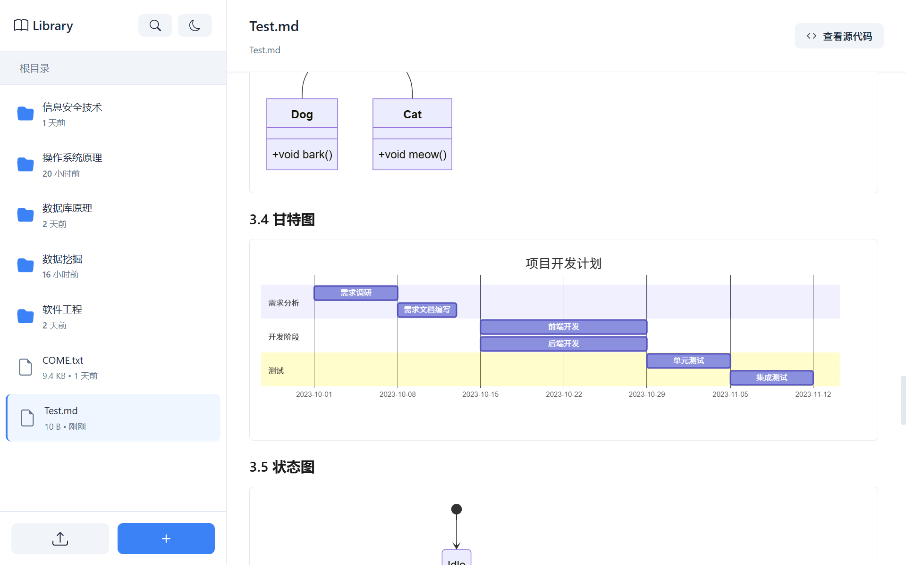

# MarkiNote ✨

<div align="center">
  
</div>

<div align="center">

[English](README.en.md) | [简体中文](README.md) | [日本語](README.ja.md) | [한국어](README.ko.md)


[](https://www.python.org/)
[](https://flask.palletsprojects.com/)
[](LICENSE)

**一个强大且完全免费的 Markdown 文档管理与预览系统** (｡･ω･｡)ﾉ♡

[产品预览](#-产品预览) • [快速开始](#-快速开始) • [功能特性](#-功能特性) • [使用指南](#-使用指南) • [贡献](#-贡献)

</div>

---

## ✨ 项目简介

MarkiNote✨ 是一个基于 Flask 的现代化 Markdown 文档管理系统，让你的 Markdown 文档管理变得简单又有趣！ (★ ω ★)

### 为什么选择 MarkiNote？

- 📝 **实时预览**：所见即所得的 Markdown 渲染
- 📚 **文档管理**：像文件管理器一样管理你的 Markdown 文档
- 🎨 **数学公式**：完美支持 LaTeX 数学公式渲染
- 🌈 **美观界面**：现代化的 UI 设计，使用体验超棒
- 🚀 **轻量快速**：基于 Flask，启动快速，资源占用少

---

## 🎯 功能特性

### 📂 文件管理
- ✅ 上传单个文件或整个文件夹
- ✅ 创建、删除、移动、编辑文件和文件夹
- ✅ 面包屑导航，轻松浏览文件结构
- ✅ 右键菜单快捷操作

### 📝 Markdown 预览
- ✅ 实时渲染 Markdown 文档
- ✅ 支持 GFM (GitHub Flavored Markdown)
- ✅ 代码高亮显示
- ✅ 表格、列表、引用等完整支持
- ✅ 数学公式渲染 (MathJax)
- ✅ 查看、编辑 Markdown 文档的源代码
- ✅ Mermaid 图表支持

---

## 📸 产品预览

**来看看MarkiNote的真容吧！每一个界面都充满了爱~** ✨

<div align="center">

<p><em>内容浏览、文件管理，操作丝滑一应俱全</em></p>
</div>

<div align="center">

<p><em>支持 LaTex 数学公式、代码块渲染</em></p>
</div>

<div align="center">

<p><em>支持 Mermaid 各类图表渲染</em></p>
</div>

<div align="center">

<p><em>文件太多？一键关键词搜索没烦恼！</em></p>
</div>

<div align="center">

<p><em>晚上想偷偷“卷”？那就切换到夜间模式吧~</em></p>
</div>

<div align="center">

<p><em>一键查看、编辑文件源代码，效率杠杠滴！</em></p>
</div>

<div align="center">

<p><em>一键进入全屏模式，展示汇报更聚焦！</em></p>
</div>

---

## 🚀 快速开始

### 环境要求

- Python 3.8 或更高版本
- pip 包管理器

### 安装步骤

1️⃣ **克隆项目**
```bash
git clone https://github.com/wink-wink-wink555/MarkiNote.git
cd MarkiNote
```

2️⃣ **安装依赖**
```bash
pip install -r requirements.txt
```

3️⃣ **下载前端资源库**

项目使用了本地化的前端库（MathJax、Mermaid、html2canvas），已包含在 `static/libs/` 目录中。如需更新，可运行：

```bash
# Windows PowerShell
Invoke-WebRequest -Uri "https://unpkg.com/mathjax@3.2.2/es5/tex-mml-chtml.js" -OutFile "static/libs/tex-mml-chtml.js"
Invoke-WebRequest -Uri "https://unpkg.com/mermaid@10/dist/mermaid.min.js" -OutFile "static/libs/mermaid.min.js"
Invoke-WebRequest -Uri "https://unpkg.com/html2canvas@1.4.1/dist/html2canvas.min.js" -OutFile "static/libs/html2canvas.min.js"

# Linux/Mac
curl -L -o static/libs/tex-mml-chtml.js "https://unpkg.com/mathjax@3.2.2/es5/tex-mml-chtml.js"
curl -L -o static/libs/mermaid.min.js "https://unpkg.com/mermaid@10/dist/mermaid.min.js"
curl -L -o static/libs/html2canvas.min.js "https://unpkg.com/html2canvas@1.4.1/dist/html2canvas.min.js"
```

4️⃣ **启动应用**
```bash
python main.py
```

5️⃣ **打开浏览器**

访问 `http://localhost:5000` 就可以开始使用啦！ ヾ(≧▽≦*)o

---

## 📖 使用指南

### 基础操作

1. **上传文件** (｡･ω･｡)ﾉ♡
   - 点击侧边栏的"上传"按钮
   - 选择上传文件或文件夹
   - 支持 `.md`、`.markdown`、`.txt` 格式

2. **预览文档** ✨
   - 在左侧文件列表中点击文件
   - 右侧会实时显示渲染后的内容
   - 点击"查看源代码"可以查看原始 Markdown

3. **管理文件** 📁
   - 右键点击文件/文件夹打开菜单
   - 可以预览、移动、删除文件
   - 使用新建文件夹按钮创建文件夹

### 高级功能

- **数学公式**：支持行内公式 `$...$` 和块级公式 `$$...$$`
- **代码高亮**：使用 ` ```语言 ` 开启代码块
- **Mermaid 图表**：支持流程图、时序图等可视化

更多详细使用说明，请查看 [lib/新手指南.md](lib/新手指南.md) (｡♥‿♥｡)

---

## 📁 项目结构

```
MarkiNote/
├── app/                    # Flask 应用核心
│   ├── __init__.py        # 应用初始化
│   ├── config.py          # 配置文件
│   ├── routes/            # 路由模块
│   │   ├── main_routes.py    # 主路由
│   │   └── library_routes.py # 文件管理路由
│   └── utils/             # 工具函数
│       ├── file_utils.py     # 文件处理
│       └── markdown_utils.py # Markdown 渲染
├── static/                # 静态资源
│   ├── libs/             # 前端库（本地化）
│   │   ├── tex-mml-chtml.js      # MathJax
│   │   ├── mermaid.min.js        # Mermaid
│   │   └── html2canvas.min.js    # html2canvas
│   ├── style.css         # 样式文件
│   └── script.js         # 前端脚本
├── templates/            # HTML 模板
│   └── index.html
├── lib/                  # 文档库（存放 Markdown 文件）
├── main.py              # 应用入口
├── requirements.txt     # 依赖列表
└── README.md           # 项目说明
```

---

## 🛠️ 技术栈

### 后端
- **Flask 3.0.0** - Web 框架
- **markdown** - Markdown 解析
- **BeautifulSoup4** - HTML 处理
- **Pygments** - 代码语法高亮

### 前端
- **Vanilla JavaScript** - 原生 JS，无框架依赖
- **MathJax 3** - 数学公式渲染
- **Mermaid** - 图表渲染
- **html2canvas** - 截图功能

---

## 🤝 贡献

欢迎所有形式的贡献！(ﾉ◕ヮ◕)ﾉ*:･ﾟ✧

### 如何贡献

1. Fork 这个项目
2. 创建你的特性分支 (`git checkout -b feature/AmazingFeature`)
3. 提交你的更改 (`git commit -m 'Add some AmazingFeature'`)
4. 推送到分支 (`git push origin feature/AmazingFeature`)
5. 打开一个 Pull Request

### 报告问题

如果你发现了 bug 或有功能建议，请在 [Issues](https://github.com/wink-wink-wink555/MarkiNote/issues) 中告诉我们！

---

## 📄 许可证

本项目采用 MIT 许可证 - 详见 [LICENSE](LICENSE) 文件

---

## 💖 致谢

感谢所有为这个项目做出贡献的开发者们！ (づ｡◕‿‿◕｡)づ

特别感谢以下开源项目：
- [Flask](https://flask.palletsprojects.com/)
- [MathJax](https://www.mathjax.org/)
- [Mermaid](https://mermaid.js.org/)

---

<div align="center">

<p><strong>Made with ❤️ by <a href="https://github.com/wink-wink-wink555">wink-wink-wink555</a></strong></p>

<p>如果这个项目对你有帮助，请给个 ⭐️ 支持一下吧！ (◕‿◕✿)</p>

</div>

