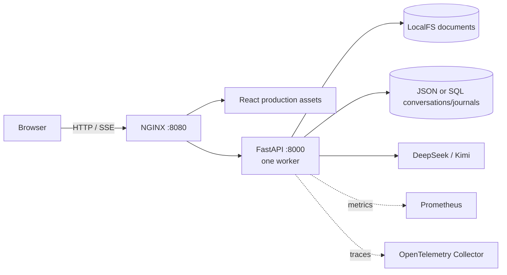

# MarkiNote ✨

<div align="center">

**一个带有受控 AI Agent 的自托管 Markdown 工作区。**

[](#project-status)
[](https://www.python.org/)
[](https://react.dev/)
[](https://github.com/wink-wink-wink555/MarkiNote/actions/workflows/ci.yml)
[](LICENSE)

[English](README.md) · [快速开始](#docker-quick-start) · [已实现功能](#implemented-features) · [AI Agent](#ai-agent) · [生产部署](#production-deployment) · [贡献指南](CONTRIBUTING.md)

</div>

---

## ✨ 概览

MarkiNote 将一个 Markdown 文件目录转化为可在浏览器中使用的写作、阅读与 AI 辅助知识工作区。当前完整版由 React 19 与 TypeScript 客户端、FastAPI 模块化单体、生成式 OpenAPI 客户端以及提供同源入口的 NGINX 网关组成。可选的 Compose profile 可以加入 PostgreSQL、Prometheus 和 OpenTelemetry。

这里的 AI 助手是 Agent，而不只是一个聊天侧栏：它可以检查文档库、搜索内容、创建和编辑文档、整理文件夹、抓取公开网页，并回滚一个选定的文件操作。所有变更型工具都受到明确保护，包括主动开启写权限、选择资源、一次性批准、有界输入、操作前快照和操作日志。

<a id="project-status"></a>

> [!IMPORTANT]
> **MarkiNote 4.0.0 是 Beta 软件。** 它适合开源审查、单机自托管评估和收集反馈。目前它还不是稳定生产版本、多用户账号系统或高可用服务。将它暴露到受信任主机之外前，请阅读[已知限制](#known-limitations)。

原有基于 Flask 的轻量版保留在 [`lite`](https://github.com/wink-wink-wink555/MarkiNote/tree/lite) 分支中。`main` 分支包含当前这套完整的 React/FastAPI/Docker 版本。

### 一览

| 领域 | 当前实现 |
|---|---|
| Web | React 19、TypeScript、Vite、CodeMirror 6、TanStack Query |
| API | Python 3.12、FastAPI、Pydantic、SQLAlchemy、Alembic |
| 入口 | NGINX 提供 SPA，并代理同源 HTTP/SSE 流量 |
| 文档 | LocalFS 上的 Markdown、兼容 Markdown 的文本和纯文本 |
| 会话 | 默认使用 JSON；可选 SQLite/PostgreSQL repository adapter |
| AI | DeepSeek 和 Kimi allowlist、流式 SSE、11 个有界工具 |
| 运维 | Docker Compose、可选指标/追踪/数据库 profile、加固的生产 overlay |
| 预期拓扑 | 单租户、一个 API 容器、一个 Uvicorn worker、一个文档写入者 |

<a id="implemented-features"></a>

## 🎯 已实现功能

| 能力 | 已实现内容 | 当前边界 |
|---|---|---|
| 文档库 | 树形浏览、文件名/路径筛选、上传、创建、保存、移动、重命名和可恢复删除 | Web UI 暂不提供回收站列表与恢复入口；API 已提供 |
| 编辑器 | CodeMirror 6、源码/预览/分屏模式、搜索、键盘编辑和下载 | 文档与预览受配置的大小限制约束 |
| 渲染 | 经过清理的 Markdown、围栏代码块、语法高亮、Mermaid、KaTeX 和主题感知输出 | 不安全 HTML 会被移除；渲染器不是通用 HTML 托管环境 |
| 可靠性 | 未保存缓冲区保护、外部变更检测、内容版本、ETag 和冲突处理界面 | 第三方客户端可以省略写入前置条件并执行盲更新 |
| 国际化 | 中文、英文、法文和日文 UI；浅色/深色主题；响应式桌面/移动布局 | 产品文档以英文和简体中文维护 |
| AI 对话 | 版本化流式事件、会话历史、取消、当前文档上下文和附件 | 真实 Provider 可用性取决于账号、区域、余额和网络 |
| AI 操作 | 11 个工具、主动开启写权限、按资源授权、精确一次性批准、操作前快照、审计记录和单操作回滚 | 不支持跨多个文件的原子整组回滚 |
| 平台 | RFC 9457 风格错误、request ID、存活/就绪检查、Prometheus 指标、可选 OpenTelemetry、确定性 OpenAPI 生成 | 就绪检查只是基础运行时检查，不能完整证明 Provider、数据或灾备链路正常 |

侧栏搜索只筛选名称和路径。Agent 可以通过 `search_files` 对文档正文进行全文搜索。

<a id="docker-quick-start"></a>

## 🚀 Docker 快速开始

### 环境要求

- Docker Desktop 或 Docker Engine
- Docker Compose v2（推荐 v2.24 或更高版本）
- 默认服务栈约需 2 GB 可用内存；可选 profile 需要更多资源

### 1. 准备配置

PowerShell：

```powershell
Copy-Item .env.example .env
docker compose config --quiet
```

Bash：

```bash
cp .env.example .env
docker compose config --quiet
```

仓库内默认配置将网关绑定到 `127.0.0.1:8080`。仅在回环地址上评估时，可以让 `MARKINOTE_ACCESS_TOKEN` 保持为空。绑定到其他网络接口前，请按照[生产部署](#production-deployment)中的说明配置访问安全。

### 2. 构建并启动

```bash
docker compose up -d --build --wait
```

打开 <http://127.0.0.1:8080>。常用检查命令：

```bash
docker compose ps
docker compose logs -f --tail=200 api gateway
curl --fail http://127.0.0.1:8080/gateway-health
curl --fail http://127.0.0.1:8080/health/live
curl --fail http://127.0.0.1:8080/health/ready
```

PowerShell 用户可以用 `Invoke-RestMethod` 替换上述三个 `curl` 调用。

`gateway-health` 只能证明 NGINX 正在提供服务。`health/live` 证明 API 进程存活。`health/ready` 还会检查四个可写数据目录，并在启用 database backend 时检查 schema revision；它仍不会验证每一条记录、Provider 或恢复路径。

### 3. 安全停止或更新

```bash
# Preserve containers, named volumes, and the Docker Desktop start button.
docker compose stop

# Rebuild after pulling a code update.
docker compose up -d --build --wait

# Remove containers and networks, but preserve named volumes.
docker compose down
```

> [!CAUTION]
> `docker compose down -v` 会删除具名数据卷。不要将它用作日常停止或升级命令。

<details><summary><strong>首次使用指南</strong></summary>

1. 从文档库侧栏创建或上传一个 `.md`、`.markdown` 或 `.txt` 文档。
2. 在源码、预览和分屏模式之间切换。Mermaid 和 KaTeX 会在预览模式中渲染。
3. 打开 AI 面板，选择 Provider/模型，然后输入临时 Provider key，或使用服务端托管 key。
4. 附加选定的文档库文件，或将当前打开的文档作为上下文。
5. 若只需读取帮助，请保持**允许写入工具（Allow write tools）**关闭。仅当 Agent 必须修改文件时才开启。
6. 审查每一个请求的资源或外部内容变更。批准与精确的工具参数绑定，并且只能消费一次。
7. 如果需要撤销一个已完成的 AI 文件操作，请在工具卡片中选择它明确的操作索引。

</details>

## 💾 数据、持久化与导入

默认 Compose 服务栈将应用数据存储在具名卷中。它**不会**绑定挂载仓库中的 `lib` 目录。

| 卷 | 容器路径 | 用途 |
|---|---|---|
| `${MARKINOTE_VOLUME_PREFIX}_library` | `/data/library` | Markdown 文档事实源 |
| `${MARKINOTE_VOLUME_PREFIX}_conversations` | `/data/conversations` | 默认 JSON 会话 |
| `${MARKINOTE_VOLUME_PREFIX}_backups` | `/data/backups` | AI 操作前快照、日志和恢复状态 |
| `${MARKINOTE_VOLUME_PREFIX}_trash` | `/data/trash` | 可恢复删除的文档 |
| `${MARKINOTE_VOLUME_PREFIX}_state` | `/data/state` | 保留的/默认数据库状态路径 |

服务栈启动后，如需在 Windows 上从 `lib` 导入本地 Markdown 文件：

```powershell
powershell.exe -NoProfile -ExecutionPolicy Bypass -File .\scripts\import-library.ps1 -Source .\lib
```

导入器接受 `.md`、`.markdown` 和 `.txt` 文件，会在上传前检查路径和名称冲突，并且绝不会把仓库目录变成实时数据源。服务端故障仍可能让一批导入只完成一部分；请先备份，并在故障后根据命令输出核对已完成的项目。

<details><summary><strong>存储与并发模型</strong></summary>

- 即使启用了 PostgreSQL profile，Markdown 正文也始终保留在 LocalFS 上。
- 写操作采用路径校验、配额、原子替换、内容版本和进程内资源锁。
- 支持的拓扑严格限定为一个 API 写入者。不要因为启用了 PostgreSQL 就增加 Uvicorn worker 或 API 副本。
- 默认的 `MARKINOTE_CONVERSATION_BACKEND=json` 将会话和日志存储为 JSON。在此 profile 中不会打开已配置的数据库 URL。
- `MARKINOTE_CONVERSATION_BACKEND=database` 会为会话、操作日志和 Agent run 日志启用 SQLAlchemy 存储。它可以在本地开发中使用 SQLite，也可以使用可选 profile 中的 PostgreSQL。
- Redis 是预留基础设施。在此版本中，它不是缓存、队列、锁服务或核心请求依赖。

</details>

<a id="ai-agent"></a>

## 🤖 AI Agent

### 可用工具

| 类型 | 工具 | 用途 |
|---|---|---|
| 读取 | `read_file`、`list_directory`、`search_files` | 检查选定文档、浏览文件夹和搜索文档正文 |
| 写入 | `write_file`、`edit_file`、`create_file`、`create_folder`、`delete_item`、`move_item` | 创建、更新、整理或可恢复地删除文档库项目 |
| Web | `web_search`、`fetch_url` | 搜索公开页面并抓取经过校验的公开 HTTP(S) URL |

Agent run 最多执行 8 轮工具、总计 24 次工具调用。Agent 文件工具的文件上限为 512 KiB，即使普通文档可以达到 2 MiB；`fetch_url` 最多接受 2 MiB，并且附加的长网页摘要调用最多考虑 20,000 个已提取字符。文件变更会写入日志，在变更前备份，并以工具卡片展示。回滚始终针对一个明确的操作索引；API 不会假装一个多文件操作组可以被原子撤销。

### 已审查的 Provider allowlist

截至 **2026-08-09**，仓库 allowlist 为：

| Provider | API endpoint | Models |
|---|---|---|
| DeepSeek | `https://api.deepseek.com` | `deepseek-v4-flash`（默认）、`deepseek-v4-pro` |
| Kimi / Moonshot China | `https://api.moonshot.cn/v1` | `kimi-k2.6` |

调用这些模型时会禁用 thinking，以保持当前多步工具协议的一致性。Key 校验会取 Provider `/models` 响应与本地经过能力审查的 allowlist 的交集；任意远程模型绝不会自动启用。Provider 可用性、价格、区域政策和模型 ID 都可能变化，请在 [DeepSeek 文档](https://api-docs.deepseek.com/updates/)和 [Kimi 文档](https://platform.kimi.com/docs/models)中核实。

### Key、隐私与批准

- 在 Web UI 中输入的 key 只存在于当前页面内存中。旧版 MarkiNote 的 local-storage key 条目会被移除，刷新或关闭页面会清除内存中的值。
- Provider/模型偏好可以持久化，但 key 不会。`MARKINOTE_AI_API_KEY` 是一个可选的全局服务端 fallback，因此必须与选定 Provider 匹配。在当前 Compose 基线中，它是 Docker 主机/容器管理员可见的环境变量；生产运维人员应通过外部 secret manager 注入，或将其留空。
- 消息、选定文档、附件和已抓取页面的摘要会发送给选定的外部 Provider。不要提交 Provider 未获授权处理的内容。
- 长网页摘要和可选的自动标题生成会发起额外 Provider 请求，并可能产生额外费用。
- 新建和恢复的会话，其 AI 写权限初始均为**关闭**。
- 未选中的资源需要批准。执行 `web_search` 或 `fetch_url` 后，任何变更都需要针对精确工具名称和规范化参数的新一次性批准，并将网页内容视为不可信指令。
- `fetch_url` 会拒绝 URL 中的凭据、私有地址/链路本地地址、不安全的重定向跳转以及 DNS/对端不匹配。`web_search` 仍然只是对公开搜索页面的 best-effort 抓取，不是有保证的正式搜索 API。
- Fake Provider 测试只验证协议行为，不能证明真实账号、余额、区域、模型或网络路径可用。

## 🏗️ 架构



MarkiNote 是模块化单体，而不是一组微服务。HTTP adapter 调用应用/领域服务，后者依赖显式的存储/Provider port。浏览器使用从 FastAPI OpenAPI schema 生成的 TypeScript 客户端。Agent 回复采用版本化 SSE envelope，普通 API 失败则使用带稳定错误码和 request ID 的 Problem Details。

### Compose profile

| Profile | 服务 | 预期用途 |
|---|---|---|
| default | `gateway`、`api` | 使用 JSON 会话存储的本地评估 |
| `postgres` + `migration` | PostgreSQL 和一次性 Alembic migration | 验证 SQL 会话/日志 adapter |
| `observability` | OpenTelemetry Collector 和 Prometheus | 本地 trace、指标和告警演练 |
| `redis` | 仅 Redis | 预留的未来基础设施；核心路径未使用 |
| production overlay | 仅使用 digest 的 API/gateway 镜像和 fail-closed 设置 | TLS ingress 后的单实例部署 |

<details><summary><strong>PostgreSQL profile</strong></summary>

仅启动 profile 不会让应用切换到 PostgreSQL。请先在 `.env` 中设置非示例密码和经过编码的连接 URL：

```dotenv
MARKINOTE_CONVERSATION_BACKEND=database
MARKINOTE_POSTGRES_DB=markinote
MARKINOTE_POSTGRES_USER=markinote
MARKINOTE_POSTGRES_PASSWORD=<strong-random-password>
MARKINOTE_DATABASE_URL=postgresql+psycopg://markinote:<url-encoded-password>@postgres:5432/markinote
MARKINOTE_AUTO_CREATE_DATABASE=false
```

然后启动数据库、执行迁移并启动应用：

```bash
docker compose --profile postgres up -d --wait postgres
docker compose --profile migration run --rm --no-deps migrate
docker compose --profile postgres up -d --build --wait
```

PostgreSQL 只替换会话和日志的持久化方式。文档正文仍然存放在单写入者的 library 卷中。

仅切换 backend 不会自动迁移已有 JSON 会话。`apps/api/scripts/migrate_conversations.py` 默认为 dry-run，并且只迁移会话数据，不迁移旧 command 或 agent-run journal。请先冻结写入、将 Alembic 升级到 head、审查其有界报告，然后才使用 `--apply` 再次运行。

</details>

<details><summary><strong>可观测性 profile</strong></summary>

如有需要，请启用追踪，然后启动该 profile：

```dotenv
MARKINOTE_OTEL_ENABLED=true
MARKINOTE_OTEL_ENDPOINT=http://otel-collector:4318/v1/traces
MARKINOTE_OTEL_SERVICE_NAME=markinote-api
```

```bash
docker compose --profile observability up -d --wait
curl --fail http://127.0.0.1:9090/-/ready
```

Prometheus 默认只绑定到回环地址。应用指标使用由服务端定义的有界 label；路径、文档名、ID、Provider 模型名、prompt、凭据和工具参数都不得成为 label 或 trace attribute。

</details>

## ⚙️ 配置参考

对于 Compose，请将 `.env.example` 复制为 `.env`。原生 API 开发时，Pydantic 还会读取 `.env.local`。下面列出运维人员最需要理解的设置。

### 访问与运行时

| 变量 | 本地默认值 | 含义 |
|---|---:|---|
| `MARKINOTE_HTTP_BIND` | `127.0.0.1` | 网关发布到的主机网络接口 |
| `MARKINOTE_HTTP_PORT` | `8080` | 主机网关端口 |
| `MARKINOTE_ENVIRONMENT` | `development` | `development`、`test` 或采用 fail-closed 校验的 `production` |
| `MARKINOTE_ACCESS_TOKEN` | 空 | 单租户部署 token；在受信任的回环地址使用之外必须设置 |
| `MARKINOTE_SECRET_KEY` | 空 | 用于签署 8 小时有效的 HttpOnly 访问 Cookie；必须与 token 不同 |
| `MARKINOTE_PUBLIC_ORIGIN` | 空 | 生产环境要求的规范 HTTPS origin |
| `MARKINOTE_TRUSTED_HOSTS` | 回环主机、`testserver`、`api` | 主机名 JSON 数组；不得包含 scheme、路径或端口 |
| `MARKINOTE_TRUSTED_ORIGINS` | `[]` | 额外接受的写请求 origin；这不是 CORS 开关 |
| `MARKINOTE_LOG_LEVEL` | `INFO` | API 日志级别 |
| `MARKINOTE_JSON_LOGS` | `true` | 结构化日志 |
| `MARKINOTE_METRICS_ENABLED` | `true` | Prometheus 指标端点 |

### 存储与保留

| 变量 | Compose 默认值 | 含义 |
|---|---:|---|
| `MARKINOTE_VOLUME_PREFIX` | `markinote` | 具名卷前缀 |
| `MARKINOTE_CONVERSATION_BACKEND` | `json` | `json` 或 `database` repository |
| `MARKINOTE_DATABASE_URL` | SQLite 路径 | 仅在 database backend 启用时使用 |
| `MARKINOTE_AUTO_CREATE_DATABASE` | 本地为 `true` | 便于本地 Compose 使用；原生 Settings 默认值和 production overlay 均为 `false` |
| `MARKINOTE_MAX_REQUEST_BYTES` | 16 MiB | 整个请求的大小限制 |
| `MARKINOTE_MAX_DOCUMENT_BYTES` | 2 MiB | 单个文档大小限制 |
| `MARKINOTE_MAX_PREVIEW_BYTES` | 2 MiB | 服务端预览大小限制 |
| `MARKINOTE_MAX_LIBRARY_BYTES` | 1 GiB | 实时文档库配额 |
| `MARKINOTE_TRASH_MAX_ITEMS` | 500 | 保留的回收站项目数量 |
| `MARKINOTE_TRASH_MAX_BYTES` | 1 GiB | 回收站字节预算 |
| `MARKINOTE_BACKUP_MAX_GROUPS` | 100 | 普通 AI 备份组数量 |
| `MARKINOTE_BACKUP_MAX_BYTES` | 256 MiB | 普通 AI 备份字节预算；请参见下方 Saga 限制 |

### AI 与运维控制

| 变量 | Compose 默认值 | 含义 |
|---|---:|---|
| `MARKINOTE_AI_API_KEY` | 空 | 可选的单一服务端 Provider 凭据 |
| `MARKINOTE_AI_GENERATE_TITLES` | `false` | 启用自动会话标题时会增加一次 Provider 请求 |
| `MARKINOTE_AGENT_RUN_RECONCILE_ON_STARTUP` | `false` | production overlay 会启用有界的过期 run 协调 |
| `MARKINOTE_AGENT_RUN_SINGLE_WRITER` | `false` | 启动协调运行前所需的单写入者确认 |
| `MARKINOTE_AGENT_RUN_RECONCILE_LIMIT` | `1000` | 单次启动批量；有效范围 1–10,000 |
| `MARKINOTE_OTEL_ENABLED` | `false` | 启用 API tracing；仅启动 profile 并不会自动开启 |
| `MARKINOTE_OTEL_ENDPOINT` | Collector HTTP 端点 | OTLP/HTTP trace 目标 |
| `MARKINOTE_OTEL_SERVICE_NAME` | `markinote-api` | 有界服务标识 |

<details><summary><strong>AI stream 限制与固定请求边界</strong></summary>

示例环境公开了 Provider frame 数量/字节、累计内容、工具参数、浏览器 SSE 事件和总流式时间的正数交叉校验限制。默认值为：每个 Provider frame 256 KiB、4,096 个 Provider 事件、8 MiB Provider 字节、每轮 512 KiB 内容、总计 1 MiB 内容、64 KiB 工具参数、每个浏览器 SSE 事件 512 KiB，以及每个 stream 600 秒。

当前有效默认值还将单条消息限制为 32 Ki 字符，附件限制为五个文件 / 每个 256 KiB / 总计 768 KiB，合并上下文限制为 120 Ki 字符。基线 Compose 文件不会转发后面这些设置；仅修改主机上名称相似的变量不会改变容器行为，除非同时更新并测试 Compose 映射。

</details>

## 🧑‍💻 原生开发

环境要求：Python 3.12、[uv](https://docs.astral.sh/uv/)、Node.js 20.19+（推荐 Node 22）和 npm。

```bash
uv sync --frozen --all-extras
npm ci --prefix packages/api-client
npm ci --prefix apps/web
npm run generate:api
uv run uvicorn markinote_api.application:app --host 127.0.0.1 --port 8000 --reload
```

在另一个终端中启动 Vite。

PowerShell：

```powershell
$env:VITE_API_PROXY='http://127.0.0.1:8000'
npm run dev --prefix apps/web
```

Bash：

```bash
VITE_API_PROXY=http://127.0.0.1:8000 npm run dev --prefix apps/web
```

Web 应用默认为 <http://127.0.0.1:5173>。Swagger UI 位于 <http://127.0.0.1:8000/api/docs>，ReDoc 位于 `/api/redoc`，原始契约位于 `/api/openapi.json`。已提交的快照和生成的 TypeScript 客户端位于 `packages/api-client/`。

## ✅ 验证与证据

从仓库根目录运行公开质量门禁：

```bash
# Python
uv run ruff check apps/api/src apps/api/scripts tests apps/api/tests infra
uv run mypy apps/api/src/markinote_api
uv run pytest -q
uv run pytest apps/api/tests -q --cov=markinote_api --cov-config=pyproject.toml --cov-report=term-missing

# API contract and Web
npm run generate:api
npm run typecheck --prefix packages/api-client
npm run typecheck --prefix apps/web
npm run lint --prefix apps/web
npm run test:coverage --prefix apps/web
npm run build --prefix apps/web

# Browser behavior
npx --prefix apps/web playwright install chromium
npm run e2e --prefix apps/web -- --project=chromium --project=mobile-chrome

# Compose model
docker compose config --quiet
```

<details><summary><strong>最近一次本地验证快照（2026-08-09）</strong></summary>

- 完整 Python 测试套件：321 个测试通过，另有 40 个 `unittest` 子测试。
- API 覆盖率测试：298 个测试通过，另有 40 个子测试；测得 API 覆盖率为 83.17%。
- Ruff 和 mypy：在 41 个后端模块上通过。
- Web：32 个 Vitest 文件、183 个测试通过；statements 90.31%、branches 79.69%、functions 79.04%、lines 90.31%。
- TypeScript、零 warning 的 ESLint、production build 和 bundle budget 均通过；production source map 不存在。
- Chromium 桌面与 Pixel 7 项目：12 个通过，4 个按设计跳过。
- 当时的本地依赖审计在两个 npm 依赖单元和锁定的 Python runtime 集合中均未报告已知漏洞。

Playwright workspace journey 会拦截 `**/api/**`；它们通过受控路由 mock 验证 React 浏览器行为，而不是字面意义上从浏览器到 FastAPI 的端到端路径。API、契约、gateway 和容器 smoke 测试分别覆盖各自的真实边界。在相关任务实际于目标环境中通过之前，不得声称 Firefox/WebKit、真实 PostgreSQL、真实 Provider、Docker Engine、CodeQL、Trivy、SBOM 或 GitHub 托管任务已经成功。

</details>

CI 定义包含 Linux 和 Windows 质量门禁、OpenAPI drift、PostgreSQL/Alembic、gateway CRUD 和 SSE、容器构建、依赖审计、CodeQL、Trivy、SBOM/provenance、恢复演练、跨浏览器检查和发布镜像验证。工作流文件只是测试定义，并不是远程运行成功的证据。

<a id="production-deployment"></a>

## 🔐 生产部署

默认服务栈针对本地评估优化。对于非回环地址或面向互联网的部署，请将 gateway 放在 TLS 之后，并且只使用由成功发布工作流生成的不可变镜像 digest 配合 production overlay。

最低生产要求：

1. 为 `MARKINOTE_ACCESS_TOKEN` 和 `MARKINOTE_SECRET_KEY` 生成两个不同的长随机值，绝不能提交它们。生产校验分别要求至少 24 和 32 个字符，推荐使用 48 字节随机值。
2. 设置仅限 HTTPS 的 `MARKINOTE_PUBLIC_ORIGIN`，以及显式包含其主机名、`api` 和 `127.0.0.1` 的 `MARKINOTE_TRUSTED_HOSTS` JSON 数组。生产环境拒绝 `*`。
3. 只要文档仍使用 LocalFS，就必须保持恰好一个 API 容器和一个 worker。
4. 设置 `MARKINOTE_AUTO_CREATE_DATABASE=false`，并在启动 database-backed API 前运行 Alembic。
5. 保持 API、PostgreSQL、Redis、Prometheus 和 OTLP 端口为私有。请在主机/编排层将 API egress 网络限制到获批准的 Provider 目标；Docker bridge 不是域名防火墙。
6. 每次重要发布前，备份并测试恢复所有业务卷；如果启用了 PostgreSQL，也要备份和测试恢复它。
7. 部署来自同一次发布的 API 与 gateway digest，并验证 `/api/v1` 报告预期版本。

浏览器通过同源 `POST /auth/access-token` 将部署 token 换成 HttpOnly、SameSite=Strict Cookie；非浏览器客户端可以使用 Bearer token。绝不能把 token 放进 URL。启用认证时，版本化 API、OpenAPI 和 API 文档都会受到保护；health 端点保持无认证，metrics 保留在 API 内部网络。NGINX 基线将普通 API 限制为每秒 10 个请求、AI 启动限制为每分钟 12 次、认证限制为每分钟 5 次，并将每个直接观测到的来源地址的并发 AI stream 限制为 4 条；位于负载均衡器后时必须审查真实客户端 IP 边界。

<details><summary><strong>生产环境骨架与部署流程</strong></summary>

```dotenv
MARKINOTE_VERSION=v4.0.0
MARKINOTE_API_IMAGE=ghcr.io/wink-wink-wink555/markinote-api
MARKINOTE_GATEWAY_IMAGE=ghcr.io/wink-wink-wink555/markinote-gateway
MARKINOTE_API_DIGEST=sha256:<release-api-manifest-digest>
MARKINOTE_GATEWAY_DIGEST=sha256:<release-gateway-manifest-digest>
MARKINOTE_VOLUME_PREFIX=markinote_prod
MARKINOTE_ENVIRONMENT=production
MARKINOTE_HTTP_BIND=127.0.0.1
MARKINOTE_HTTP_PORT=8080
MARKINOTE_ACCESS_TOKEN=<48-byte-or-longer-random-value>
MARKINOTE_SECRET_KEY=<different-48-byte-or-longer-random-value>
MARKINOTE_PUBLIC_ORIGIN=https://notes.example.com
MARKINOTE_TRUSTED_HOSTS='["notes.example.com","api","127.0.0.1","localhost"]'
MARKINOTE_AUTO_CREATE_DATABASE=false
MARKINOTE_AGENT_RUN_RECONCILE_ON_STARTUP=true
MARKINOTE_AGENT_RUN_SINGLE_WRITER=true
MARKINOTE_AGENT_RUN_RECONCILE_LIMIT=1000
```

将其保存为受保护的 `.env.production`；不要把解析后的文件粘贴到日志或工单中。然后执行：

```bash
python3 infra/ci/production-compose-preflight.py --env-file .env.production
docker compose --env-file .env.production -f infra/compose.yaml -f infra/compose.production.yaml pull api gateway migrate

# Run this when the database adapter/schema is in use.
docker compose --env-file .env.production -f infra/compose.yaml -f infra/compose.production.yaml --profile migration run --rm --no-deps migrate

docker compose --env-file .env.production -f infra/compose.yaml -f infra/compose.production.yaml up -d --no-build --wait api gateway
```

执行同源健康检查，以及隔离的“创建 → 编辑 → 预览 → 删除/恢复”旅程。在完成发布前，观察重启次数、5xx 比率、p95 延迟、磁盘空间、打开的 stream 数量和 Provider 错误。

</details>

## 🛟 备份、恢复与回滚

- `/data/backups` 保存 AI 回滚与 Saga 恢复材料；它**不是**灾难恢复备份。仓库不会替你安排每日或异地备份。
- 备份 `library`、`conversations`、`backups`、`trash` 和 `state`；启用 PostgreSQL 时，还要运行 `pg_dump --format=custom --no-owner --no-acl`。
- 为获得一致的检查点，请在执行数据库 dump 和卷归档**之前**停止 gateway/API 写入。对归档计算哈希、加密异地主机副本，并记录镜像 digest 和 schema revision。
- 恢复到一个明确命名的新卷前缀中。在启动 API/gateway 前恢复数据库和文件卷，然后验证哈希、Alembic head、健康状态以及读/写/恢复用户旅程。
- 初始运维目标为每日完整备份、重要发布前额外备份、RPO 24 小时，以及恢复演练 RTO 2 小时。这些是未经验证的目标，不是服务保证。
- 在未检查记录的 after-fingerprint 前，绝不能用旧的 AI 操作前快照覆盖当前文件。旧版或损坏的记录会 fail closed，需要隔离检查。
- 在事故复盘完成前保留原故障卷。备份归档可能包含文档、会话、prompt 和 before-image；请加密异地副本并限制访问。

在依赖备份流程前，请先运行仓库的隔离演练脚本：

```bash
python infra/ci/local-volume-restore-rehearsal.py --artifact-dir .artifacts/local-volume-restore
python infra/ci/backup-restore-rehearsal.py --artifact-dir .artifacts/postgres-restore
```

这些脚本是测试演练，不能代替经过运维审批的生产备份系统。

<details><summary><strong>AI 操作与会话恢复</strong></summary>

- 变更在修改文件前预留备份容量并记录 before-image。普通已完成备份组会保留在配置的数量/字节限制内。
- 活跃组使用 lease。单写入者进程重启后，有界 reconciliation 可以标记可安全恢复的过期 run；不完整或完整性校验失败的证据会保留给运维人员审查，而不是被静默删除。
- `prepared`、`applied` 和 `recovery_required` 命令状态是崩溃 fence。人工干预前请保留 library 和 backup 卷。
- 会话截断/删除使用 Saga。终止状态记录会移除消息正文和快照；未解决的记录会保留恢复所需的证据。
- 普通 retention 只移除安全终态组。活跃、quarantined、integrity-error 或 recovery-required 证据会被保留。会话正文没有自动 TTL，回收站超过限制后会永久淘汰最旧项目。
- 首先以 dry-run 模式运行 `apps/api/scripts/reconcile_agent_runs.py`。只有在移除写流量、停止所有旧 API 写入者并明确确认单写入者拓扑后，才能应用变更。
- API 回滚需要 `groupId` 和明确的 `operationIndex`。它会检查当前 fingerprint，并且只恢复该操作；绝不会承诺对整个组进行事务性回滚。

</details>

## 🩺 监控与事故响应

使用响应中的 `X-Request-ID` 关联 gateway 和 API 日志。绝不能把 Authorization header、Cookie、AI key、完整 prompt、附件、文档正文或工具参数复制到事故证据中。

<details><summary><strong>告警处理流程</strong></summary>

<a id="api-unavailable"></a>

### API 不可用

运行 `docker compose ps`，检查最近 300 行 API/gateway 日志，并依次检查 gateway、liveness 和 readiness。如果 gateway 健康但 liveness 失败，请检查崩溃、配置或 OOM 证据。如果 liveness 通过而 readiness 失败，请检查卷权限、磁盘/inode 和数据库 revision。如果所有本地检查均通过，请检查 TLS、ingress、Host/Origin 和防火墙规则——不要为了绕过 gateway 而直接暴露 API。

<a id="elevated-5xx-rate"></a>

### 5xx 比率升高

按 route、status、version 和 request ID 对失败分组。区分 Provider、文件 I/O、数据库和契约故障。如果新版本是共同因素，并且可能影响数据完整性，请停止写入，并将 API/gateway 作为匹配的 digest 对一起回滚。

<a id="latency-regression"></a>

### 延迟回归

评估非流式 p95 前先排除 AI SSE route。比较相同 fixture 和环境，然后检查 CPU 节流、内存、磁盘等待、目录规模、数据库连接和 Provider 等待时间。不要通过增加 Uvicorn worker 来掩盖 LocalFS 锁竞争。

<a id="restart-loop"></a>

### 重启循环

检查退出码、OOM 事件、只读文件系统写入、UID 10001 卷权限和健康检查超时。保留最后一次故障日志，每次只改变一个变量；应回滚不稳定镜像，而不是禁用健康检查。

</details>

<a id="known-limitations"></a>

## ⚠️ 已知限制

### 高优先级

- **Conversation Saga 保留策略尚未完全统一。** backups 卷中的恢复记录和快照尚未全部计入 `MARKINOTE_BACKUP_MAX_BYTES`，因此该值并不是所有备份产物的绝对上限。未解决的 Saga 可能保留会话 before-image，并且当前没有自动 TTL。请监控该卷并及时处理 recovery reference。
- **外部验收证据仍待补充。** 本地 Fake Provider 与契约测试不能证明真实 DeepSeek/Kimi 账号、首次 GitHub Actions/CodeQL/Trivy/SBOM 运行、已发布镜像 digest、Docker Engine 启动、真实 PostgreSQL 实例或目标环境恢复。

### 产品与 API 缺口

- 回收站列表/恢复端点已存在，但 React UI 尚未公开它们。
- 侧栏搜索覆盖文件名和路径；正文搜索只对 Agent 开放。
- `web_search` 以 best-effort 方式抓取公开搜索页面。
- 官方 Web 保存会使用内容版本，但第三方客户端可以省略前置条件。
- 对无效或缺失 `conversationId` 的处理尚未在所有路径上完全统一。
- 部分消息、附件和上下文默认值在多个契约中重复定义，尚未从单一 schema 生成。

### 运维边界

- 仅支持单租户和单写入者；不提供账号、OIDC、RBAC、租户隔离或 HA。
- PostgreSQL 不会让 LocalFS 文档存储变成多写入者安全；Redis 不在请求路径上。
- 回滚针对一个明确操作，而不是原子的多文件事务。
- 损坏的 JSON 审计记录尚无自动隔离/修复工作流。
- readiness 不会扫描每条记录、Provider、备份或灾备路径。
- PowerShell 导入器可能在上游故障后留下一批部分完成的结果。
- AI stream/lease 最大值和 gateway SSE timeout 是不同边界；需要通过日志区分缓慢的 Provider 与 gateway 中断。

## 🧭 故障排查

<details><summary><strong>常见启动与使用问题</strong></summary>

| 现象 | 检查项 |
|---|---|
| 端口 8080 不可用 | 修改 `MARKINOTE_HTTP_PORT`，然后运行 `docker compose config --quiet` |
| Gateway 已启动但 API 不健康 | 检查 `docker compose logs --tail=300 api`；验证卷空间和 UID 10001 写权限 |
| 身份验证循环或返回 401/403 | 检查 token、HTTPS public origin、精确的 Host/Origin 值以及浏览器 Cookie 策略；绝不能把 token 放入查询字符串 |
| 本地文件没有出现 | Docker 使用具名卷；请运行 PowerShell 导入器，不要直接编辑仓库 `lib` |
| PostgreSQL profile 仍使用 JSON | 设置 backend、URL、凭据和 `AUTO_CREATE_DATABASE=false`，然后在 API 启动前运行 migration 服务 |
| 请求返回 413 | 检查 16 MiB 请求限制、2 MiB 文档/预览限制，以及更小的附件/Agent 工具限制 |
| 请求返回 429 | 退避并检查 NGINX 的按来源限流；位于代理后时，确认不同客户端没有被合并成同一个来源地址 |
| AI 报告 `api_key_required` | 输入临时 key，或为选定 Provider 注入唯一的服务端 fallback key |
| AI key 校验通过但对话失败 | 检查 Provider 账号/区域/余额、allowlist 模型可用性、网络 egress 和 Provider 日志，且不得打印 key |
| AI stream 提前停止 | 使用 request ID 关联 Provider 读取边界、300 秒 gateway idle timeout 与 600 秒应用 stream 限制 |
| 保存返回 409 | 磁盘版本已经改变；保留本地 buffer，进行比较，然后明确选择保留本地内容或重新加载磁盘内容 |
| 生成的客户端出现 drift | 运行 `npm run generate:api`，检查 OpenAPI 快照和生成的 TypeScript 差异，然后重新运行 typecheck |

</details>

## 📁 仓库结构

```text
apps/api/                 FastAPI 应用、Alembic migration、脚本和 API 测试
apps/web/                 React/TypeScript SPA、单元测试和 Playwright journey
packages/api-client/      已提交的 OpenAPI 快照和生成的 TypeScript 客户端
infra/                    Compose 拓扑、NGINX、监控和 CI smoke 程序
scripts/                  面向用户的维护/导入辅助脚本
tests/                    跨组件、恢复、可观测性和供应链契约
.github/                  CI、CodeQL、跨浏览器、发布工作流和模板
README.md                 规范英文文档
README_CN.md              简体中文文档
```

公开运维文档有意完整地包含在根目录的两份 README 文件中。本地设计说明和私有审计材料不会进入仓库发布，并且构建、测试、镜像、告警或公开链接都不得依赖它们。

<a id="release-governance"></a>

## 📦 发布与仓库治理

- 保护 `main`；合并前要求经过审查的 Pull Request 和成功的 required check。
- 将 Flask 版本保留在 `lite`。完整版开发和发布都属于 `main`。
- 仅从经过审查的 `main` commit 创建 SemVer tag。发布工作流必须从相同 source SHA 发布 API 和 gateway 镜像。
- 部署不可变 manifest digest，而不是可变 tag。保留版本、source SHA、配对 digest、CI/发布链接、SBOM/provenance、migration revision、备份/恢复证据和 smoke 结果。
- 工作流定义不会自动启用 GitHub 分支保护、环境审批、registry 不可变策略或 secret 管理；请在托管平台中配置这些控制。
- 绝不能把解析后的环境文件、凭据、数据库 URL、私有文档或未脱敏截图附加到发布证据中。

发布说明请参阅 [CHANGELOG.md](CHANGELOG.md)，开发规则请参阅 [CONTRIBUTING.md](CONTRIBUTING.md)，私下报告安全漏洞请参阅 [SECURITY.md](SECURITY.md)。

## 🤝 贡献

欢迎提交 issue 和 Pull Request。打开 PR 前：

1. 说明用户可见的变更，以及对数据、安全和并发的影响。
2. 添加或更新测试与生成的契约。
3. 运行上文相关质量门禁。
4. 只包含经过脱敏的 UI 证据。
5. 当行为、配置、运维或限制发生变化时，同时更新两个语言版本的 README。

请按照 [SECURITY.md](SECURITY.md) 私下报告漏洞，不要通过公开 issue 报告。

## 📄 许可证

MarkiNote 基于 [MIT License](LICENSE) 发布。

<div align="center">

由 [wink-wink-wink555](https://github.com/wink-wink-wink555) 构建。如果 MarkiNote 对你有帮助，欢迎点亮 ⭐。

</div>
