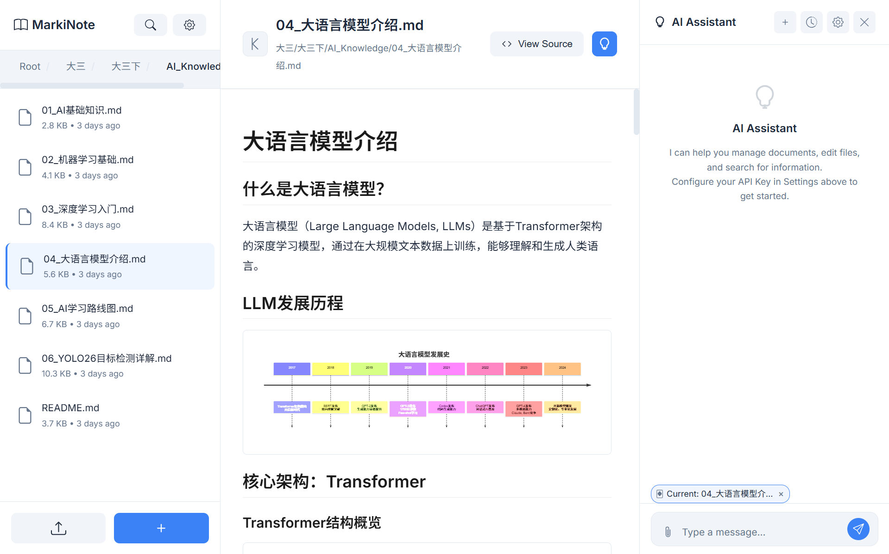
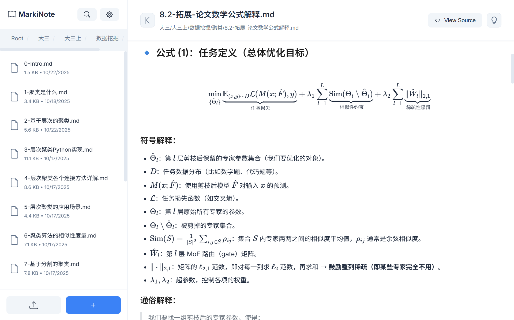
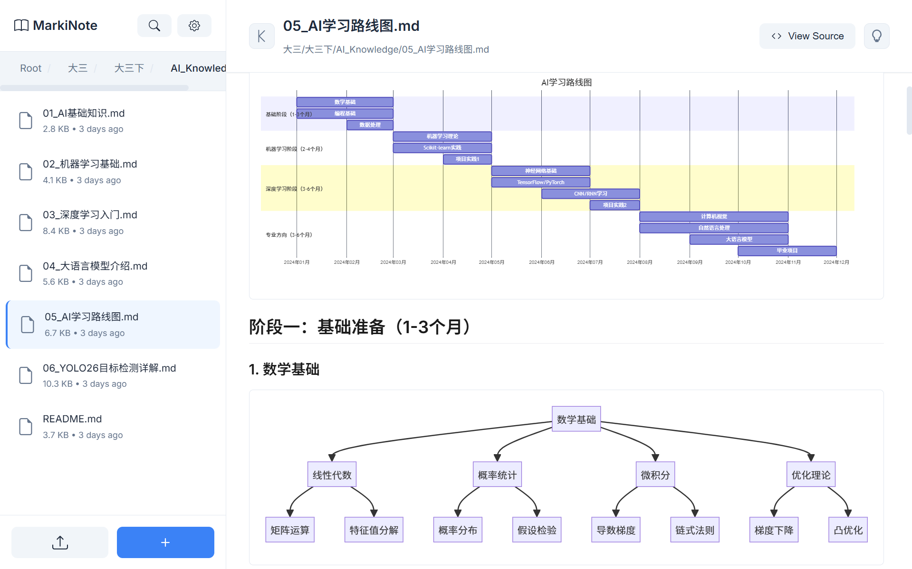
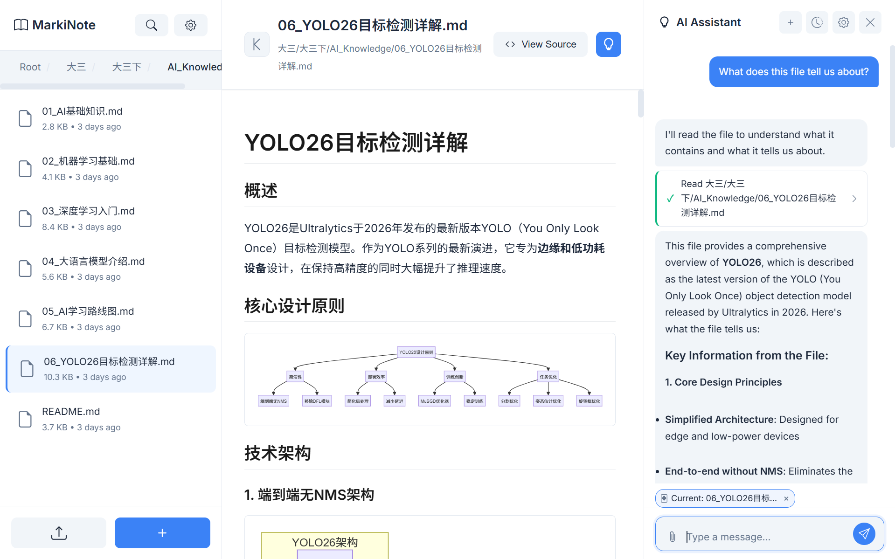
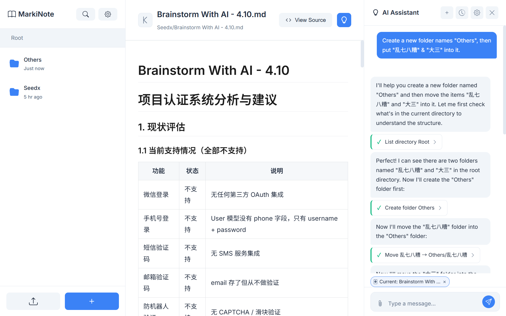
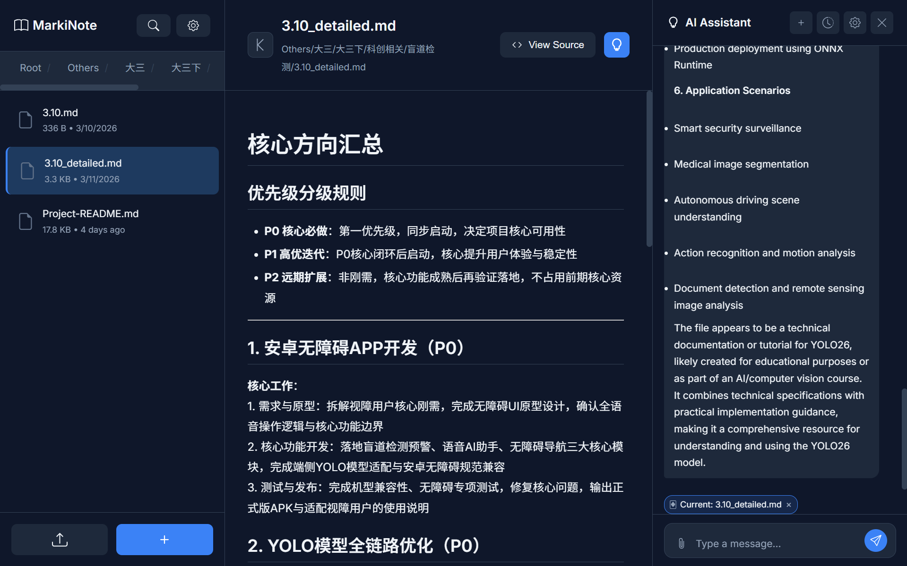
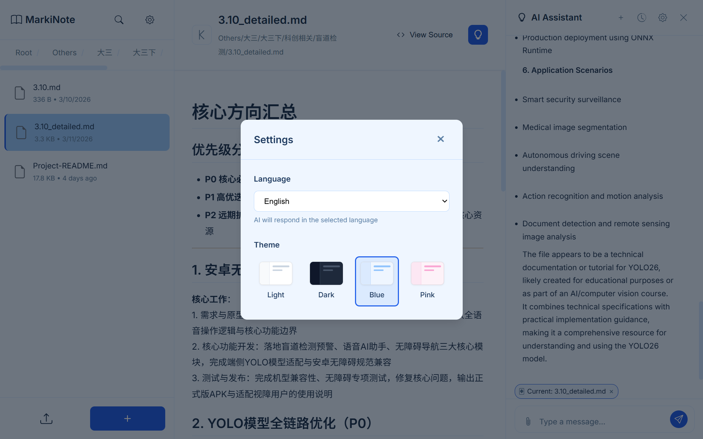

# MarkiNote ✨

<div align="center">
  
</div>

<div align="center">


[](https://www.python.org/)
[](https://flask.palletsprojects.com/)
[](LICENSE)

**An AI Agent-powered Markdown Document Management & Reading System** 🤖📝

English | [简体中文](README.md)

[Preview](#-preview) • [Quick Start](#-quick-start) • [Features](#-features) • [AI Agent](#-ai-agent-capabilities) • [Contributing](#-contributing)

</div>

---

## ✨ About

**MarkiNote✨** is not just a Markdown reader — it's an **intelligent document management system powered by a built-in AI Agent**.

The AI Agent understands your intent and autonomously invokes 11 different tools to read, create, edit, delete, move files, and even search the web or fetch webpage content. Every file modification made by the AI is automatically backed up with one-click rollback support, so you can confidently let AI manage your documents.

### Why MarkiNote?

- 🤖 **AI Agent**: More than chatting — AI directly operates your document library (read, write, edit, delete, move, search)
- 🔧 **11 Tools**: AI autonomously decides which tools to call via Function Calling — a true Agent experience
- 🔄 **Auto Backup & Rollback**: Every AI file modification is automatically backed up with per-step or batch rollback
- 📝 **Full Markdown Rendering**: LaTeX math, Mermaid diagrams, syntax highlighting — all supported
- 📚 **Document Manager**: Upload, create, move, rename, delete — manage docs like a file manager
- 🌍 **Multi-language / Multi-theme**: Supports 中文 / English / Français / 日本語, with 4 switchable themes
- 🚀 **Lightweight**: Built on Flask + Vanilla JS, no frontend framework needed, fast startup and low resource usage

---

## 🤖 AI Agent Capabilities

This is MarkiNote's core highlight. The AI assistant isn't a simple Q&A bot — it's a **real Agent with tool-calling capabilities**:

### Tool List

| Tool | Description |
|------|-------------|
| `read_file` | Read file content, supports reading by line range |
| `write_file` | Overwrite file content (auto backup) |
| `edit_file` | Find-and-replace editing (auto backup) |
| `create_file` | Create new file with initial content |
| `create_folder` | Create folder, supports nested directories |
| `delete_item` | Delete file or folder (auto backup) |
| `move_item` | Move or rename file/folder (auto backup) |
| `list_directory` | List directory contents |
| `search_files` | Full-text search across the document library |
| `web_search` | Search the internet (Bing / DuckDuckGo) |
| `fetch_url` | Fetch webpage content with auto AI summarization for large pages |

### Agent Workflow

```
User Instruction → AI Understands Intent → Selects Tools → Executes → Returns Result
                        ↓
              Multi-turn iteration (up to 15 rounds)
                        ↓
          All file changes auto-backed up → One-click rollback
```

### Supported AI Providers

Currently supports the following AI services (all OpenAI API-compatible, easily extensible):

| Provider | Models |
|----------|--------|
| **DeepSeek** | DeepSeek-V3 |
| **Kimi (Moonshot)** | Moonshot 8K / 32K / 128K |

---

## 🎯 Features

### 📂 File Management
- ✅ Upload individual files or entire folders
- ✅ Create, delete, move, rename files and folders
- ✅ Breadcrumb navigation for easy browsing
- ✅ Context menu for quick actions
- ✅ File search

### 📝 Markdown Rendering
- ✅ Real-time Markdown rendering
- ✅ GFM (GitHub Flavored Markdown) support
- ✅ Syntax highlighting (Pygments)
- ✅ Math formula rendering (MathJax 3)
- ✅ Mermaid diagrams (flowcharts, sequence diagrams, Gantt charts, etc.)
- ✅ Tables, lists, blockquotes — full support
- ✅ View / Edit source code
- ✅ Fullscreen reading mode

### 🤖 AI Assistant
- ✅ Sidebar AI chat panel
- ✅ Streaming output (SSE) with real-time responses
- ✅ Tool call cards with visual operation display
- ✅ Conversation history management (create, rename, delete)
- ✅ Message editing & rollback (auto-restores file changes on rollback)
- ✅ File attachments: send documents from the library as context
- ✅ Context awareness: auto-links the currently previewed file
- ✅ Web search & webpage content fetching

### 🎨 UI & Experience
- ✅ 4 Themes: Light / Dark / Blue / Pink
- ✅ 4 Languages: 中文 / English / Français / 日本語
- ✅ Draggable resize for sidebar and AI panel
- ✅ One-click screenshot export to JPG
- ✅ Responsive layout for different screen sizes

---

## 📸 Preview

<div align="center">

<p><em>📖 Content browsing & file management — document tree + live rendering</em></p>
</div>

<div align="center">

<p><em>🔢 LaTeX math formulas & syntax-highlighted code blocks</em></p>
</div>

<div align="center">

<p><em>📊 Mermaid flowcharts, sequence diagrams, and more</em></p>
</div>

<div align="center">

<p><em>🤖 AI Agent chat panel — smart tool calling with visual operation process</em></p>
</div>

<div align="center">

<p><em>🔧 AI autonomously reads & edits files — every operation is rollbackable</em></p>
</div>

<div align="center">

<p><em>🌙 Dark theme — easy on the eyes for nighttime use</em></p>
</div>

<div align="center">

<p><em>🌍 Multi-language interface — Chinese / English / French / Japanese</em></p>
</div>

---

## 🚀 Quick Start

### Requirements

- Python 3.8 or higher
- pip package manager

### Installation

1️⃣ **Clone the repository**
```bash
git clone https://github.com/wink-wink-wink555/MarkiNote.git
cd MarkiNote
```

2️⃣ **Create a virtual environment (recommended)**
```bash
python -m venv .venv

# Windows PowerShell
.venv\Scripts\activate

# Linux/Mac
source .venv/bin/activate
```

3️⃣ **Install dependencies**
```bash
pip install -r requirements.txt
```

4️⃣ **Start the application**
```bash
python main.py
```

5️⃣ **Open your browser**

Visit `http://localhost:5000` and start using MarkiNote!

### Configure the AI Assistant

1. Get an API Key: Visit [DeepSeek Platform](https://platform.deepseek.com/) or [Moonshot AI](https://platform.moonshot.cn/) to register and obtain an API Key
2. Open the AI panel in the app (click the 🤖 button in the top right)
3. Click the settings icon, select AI provider and model, enter your API Key
4. Click "Validate" to confirm the connection, then start chatting!

> **Tip**: To use DuckDuckGo with the `web_search` tool, set the `HTTPS_PROXY` environment variable. By default, Bing search is used.

---

## 📖 Usage Guide

### Basic Operations

1. **Upload files** — Click the "Upload" button in the sidebar
2. **Preview documents** — Click a file in the left panel for live rendering on the right
3. **Manage files** — Right-click files/folders to rename, move, or delete

### Using the AI Assistant

1. **Open the AI panel** — Click the AI button in the top right
2. **Chat with AI** — Describe what you need, for example:
   - "Create a study notes template for me"
   - "Reorganize the files in the notes folder by date"
   - "Search my documents for Python content and summarize it"
   - "Translate this document to English"
3. **File context** — When previewing a file, AI auto-links it; you can also manually attach multiple files
4. **Rollback** — If you're not happy with an AI change, click "Rollback" on the tool card to restore

---

## 📁 Project Structure

```
MarkiNote/
├── app/                          # Flask backend
│   ├── __init__.py              # App factory
│   ├── config.py                # Configuration
│   ├── routes/                  # Route modules
│   │   ├── main_routes.py      # Main routes (page rendering)
│   │   ├── library_routes.py   # Document library API (CRUD)
│   │   └── ai_routes.py        # AI assistant API (chat/backup/rollback)
│   └── utils/                   # Utility modules
│       ├── file_utils.py       # File operations
│       ├── markdown_utils.py   # Markdown rendering
│       ├── ai_provider.py      # AI provider adapter
│       ├── ai_tools.py         # AI tool definitions & execution
│       └── ai_backup.py        # Backup & rollback management
├── static/                      # Frontend assets
│   ├── script.js               # Main frontend logic
│   ├── ai-chat.js              # AI chat panel
│   ├── i18n.js                 # Internationalization (4 languages)
│   ├── style.css               # Main styles
│   ├── ai-chat.css             # AI panel styles
│   └── libs/                   # Locally hosted third-party libs
│       ├── tex-mml-chtml.js    # MathJax
│       ├── mermaid.min.js      # Mermaid
│       └── html2canvas.min.js  # html2canvas
├── templates/
│   └── index.html              # Single-page app template
├── lib/                         # Document library (user documents stored here)
├── main.py                      # Entry point
├── requirements.txt             # Python dependencies
├── LICENSE                      # MIT License
└── README.md
```

---

## 🛠️ Tech Stack

### Backend
- **Flask 3.0.0** — Web framework
- **markdown + BeautifulSoup4** — Markdown parsing & HTML processing
- **Pygments** — Code syntax highlighting
- **requests** — AI API calls & web scraping
- **OpenAI-compatible API** — Supports DeepSeek / Moonshot and more

### Frontend
- **Vanilla JavaScript** — Zero framework dependencies
- **MathJax 3** — LaTeX math rendering
- **Mermaid** — Diagram rendering
- **html2canvas** — Screenshot export
- **SSE (Server-Sent Events)** — AI streaming responses

### AI Agent
- **Function Calling** — AI autonomously invokes 11 tools
- **Streaming Chat (SSE)** — Real-time display of AI replies and tool calls
- **Auto Backup System** — Pre/post modification snapshots with operation-group rollback
- **Subagent Architecture** — Large webpage content auto-summarized by a secondary AI call

---

## 🤝 Contributing

Contributions of all kinds are welcome!

### How to Contribute

1. Fork the project
2. Create your feature branch (`git checkout -b feature/AmazingFeature`)
3. Commit your changes (`git commit -m 'Add some AmazingFeature'`)
4. Push to the branch (`git push origin feature/AmazingFeature`)
5. Open a Pull Request

### Report Issues

Found a bug or have a feature suggestion? Let us know in [Issues](https://github.com/wink-wink-wink555/MarkiNote/issues)!

---

## 📄 License

This project is licensed under the MIT License — see the [LICENSE](LICENSE) file for details.

---

## 💖 Acknowledgments

Thanks to these open source projects:
- [Flask](https://flask.palletsprojects.com/)
- [MathJax](https://www.mathjax.org/)
- [Mermaid](https://mermaid.js.org/)
- [DeepSeek](https://deepseek.com/)
- [Moonshot AI](https://www.moonshot.cn/)

---

<div align="center">

**Made with ❤️ by [wink-wink-wink555](https://github.com/wink-wink-wink555)**

If this project helps you, please give it a ⭐️!

</div>
