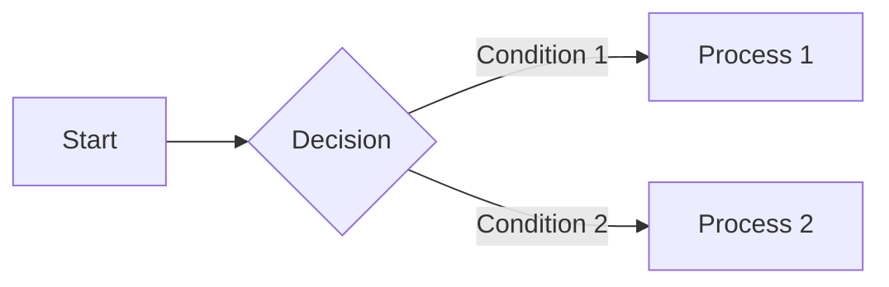

# Welcome to MarkiNote ✨

Hello! Welcome to **MarkiNote** — your intelligent Markdown document management and AI collaboration companion.

This is not just a Markdown **reader**, but an AI Agent system that **understands** your needs and **actively helps you manage documents**.

---

## 🚀 3-Minute Quick Start

### 1️⃣ Configure Your AI Assistant
Click the **🤖 AI Assistant button** in the top-right corner, then:
- Select AI provider (DeepSeek or Moonshot/Kimi)
- Enter your API Key
- Click "Verify" to confirm successful connection

> 💡 **Get API Key**: Visit [DeepSeek Platform](https://platform.deepseek.com/) or [Moonshot AI](https://platform.moonshot.cn/) to register and get your key for free

### 2️⃣ Try Your First AI Command
In the AI chat panel, try typing:
- `"Create a to-do list template for me"`
- `"Summarize the current document"`
- `"Translate this document into English"`

Watch how the AI **automatically calls tools** to complete the task!

### 3️⃣ Explore File Management
- **Upload files**: Click the "Upload" button in the left sidebar
- **Create new document**: Right-click on a folder → New File
- **Markdown rendering**: Click any `.md` file to see real-time rendering

---

## 🤖 What Can the AI Agent Do for You?

MarkiNote's AI is not just a simple chatbot — it has **real operational capabilities**:

| Capability | Example Commands |
|------------|------------------|
| **📖 Read files** | `"Read the content of project/notes.md and summarize it"` |
| **✏️ Edit files** | `"Add a code block example after the third paragraph"` |
| **📝 Create files** | `"Create a Python study notes template for me"` |
| **🗂️ Manage files** | `"Rename files in meeting-notes folder by date"` |
| **🔍 Search content** | `"Search for content about 'budget' in all documents"` |
| **🌐 Web search** | `"Search for the latest Python 3.12 features"` |

### 🔧 Visual Tool Calling
When the AI uses tools, you'll see **tool cards** displaying the operation process in real-time. Every file modification is **auto-backed up** — click "Rollback" to restore if you're not satisfied.

---

## ✨ Full Markdown Support

MarkiNote perfectly renders the following:

### Math Formulas (LaTeX)

$$E = mc^2$$


### Mermaid Diagrams


### Code Highlighting
```python
def hello_markinote():
    print("Hello, AI-powered Markdown!")
```

### Other Features
- ✅ Tables, task lists, blockquotes
- ✅ One-click JPG export
- ✅ 4 themes (Light / Dark / Blue / Pink)

---

## 💡 Recommended Tryouts for New Users

### Scenario 1: Quick Note Organization
```
"Create a study notes template for me, including title, date, key takeaways, and to-do items"
```

### Scenario 2: Batch Operations
```
"List all files in the docs folder and rename files starting with 'old-' to 'archive-'"
```

### Scenario 3: Content Aggregation
```
"Read the README files from docs/project-A and docs/project-B, compare the differences, and generate a comparison report"
```

### Scenario 4: Web Research
```
"Search for 'best Markdown editors 2024' and organize the results into a report saved in the research folder"
```

---

## 🛡️ Safety & Backup

**Don't worry about AI mistakes!**
- **Auto-backup** created before every file modification
- Click **"Rollback"** in tool cards to restore a single operation
- Click **"Rollback all operations in this message"** in the message menu to undo in batch

---

## 🆘 Need Help?

| Resource | Link |
|----------|------|
| 📖 Full Documentation | [Project README](https://github.com/wink-wink-wink555/MarkiNote) |
| 🐛 Report Issues | [GitHub Issues](https://github.com/wink-wink-wink555/MarkiNote/issues) |
| ⭐ Support Project | Give us a Star on GitHub! |

---

## 🎯 Next Steps

1. **Upload a few Markdown files** to test the preview effects
2. **Ask AI to create a document structure** for managing your notes
3. **Explore the Dark Theme** (click the theme toggle in the top-right) to protect your eyes

---

Happy writing in MarkiNote! ✨

**Made with ❤️ by [wink-wink-wink555](https://github.com/wink-wink-wink555)**