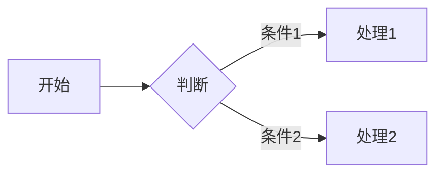

# Welcome to MarkiNote ✨

你好！欢迎来到 **MarkiNote** —— 你的智能 Markdown 文档管理与 AI 协作伙伴。

这是一个不仅仅能**阅读** Markdown，还能**理解**你的需求并**主动帮你管理文档**的 AI Agent 系统。

---

## 🚀 3 分钟快速开始

### 1️⃣ 配置你的 AI 助手
点击右上角的 **🤖 AI 助手按钮**，然后：
- 选择 AI 提供商（DeepSeek 或 Moonshot/Kimi）
- 输入你的 API Key
- 点击"验证"确认连接成功

> 💡 **获取 API Key**：前往 [DeepSeek 开放平台](https://platform.deepseek.com/) 或 [Moonshot AI](https://platform.moonshot.cn/) 免费注册获取

### 2️⃣ 尝试你的第一条 AI 指令
在 AI 对话面板中，试着输入：
- `"帮我创建一个待办事项模板"`
- `"总结一下当前这篇文档"`
- `"把这篇文档翻译成英文"`

观察 AI 如何**自动调用工具**来完成任务！

### 3️⃣ 探索文件管理
- **上传文件**：点击左侧边栏的"上传"按钮
- **新建文档**：右键点击文件夹 → 新建文件
- **Markdown 渲染**：点击任意 `.md` 文件查看实时渲染效果

---

## 🤖 AI Agent 能为你做什么？

MarkiNote 的 AI 不是简单的聊天机器人，它拥有**真实操作能力**：

| 能力 | 示例指令 |
|------|----------|
| **📖 读取文件** | `"读取 project/notes.md 的内容并总结"` |
| **✏️ 编辑文件** | `"在第三段后面添加一个示例代码块"` |
| **📝 创建文件** | `"帮我创建一个 Python 学习笔记模板"` |
| **🗂️ 管理文件** | `"把 meeting-notes 文件夹下的文件按日期重命名"` |
| **🔍 搜索内容** | `"在所有文档中搜索关于'预算'的内容"` |
| **🌐 联网搜索** | `"搜索最新的 Python 3.12 新特性"` |

### 🔧 工具调用可视化
当 AI 使用工具时，你会看到**工具卡片**实时展示操作过程。每步文件修改都会**自动备份**，不满意可以点击"回滚"一键恢复。

---

## ✨ Markdown 全功能支持

MarkiNote 完美支持以下渲染：

### 数学公式 (LaTeX)

$$E = mc^2$$


### Mermaid 图表


### 代码高亮
```python
def hello_markinote():
    print("Hello, AI-powered Markdown!")
```

### 其他特性
- ✅ 表格、任务列表、引用
- ✅ 图表一键导出 JPG
- ✅ 4 种主题切换（浅色/深色/蓝色/粉色）

---

## 💡 新用户推荐尝试

### 场景 1：快速整理笔记
```
"帮我创建一个学习笔记模板，包含标题、日期、要点总结和待办事项"
```

### 场景 2：批量操作
```
"列出 docs 文件夹中的所有文件，并把以'old-'开头的文件重命名为'archive-'"
```

### 场景 3：内容聚合
```
"读取 docs/project-A 和 docs/project-B 的 README，对比两个项目的差异并生成一份对比报告"
```

### 场景 4：联网研究
```
"搜索'2024年最佳 Markdown 编辑器'，把搜索结果整理成一份报告保存到 research 文件夹"
```

---

## 🛡️ 安全与备份

**不用担心 AI 误操作！**
- 每次文件修改前都会**自动创建备份**
- 在工具卡片中点击**"回滚"**可恢复单个操作
- 在消息菜单中点击**"回滚此消息的所有操作"**可批量撤销

---

## 🆘 需要帮助？

| 资源 | 链接 |
|------|------|
| 📖 完整文档 | [项目 README](https://github.com/wink-wink-wink555/MarkiNote) |
| 🐛 报告问题 | [GitHub Issues](https://github.com/wink-wink-wink555/MarkiNote/issues) |
| ⭐ 支持项目 | 在 GitHub 给我们一个 Star！ |

---

## 🎯 下一步建议

1. **上传几个 Markdown 文件** 测试预览效果
2. **尝试让 AI 帮你创建一个文档结构** 来管理你的笔记
3. **探索深色主题**（点击右上角主题切换按钮）保护眼睛

---

祝你在 MarkiNote 中写作愉快！✨

**Made with ❤️ by [wink-wink-wink555](https://github.com/wink-wink-wink555)**