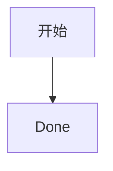

# Guide 指南

这是 **企业级等价性** fixture with *English emphasis* and ~~已删除内容~~.

- 中文列表项
- English list item

| 能力 | 状态 |
| --- | --- |
| Preview | Ready |
| 编辑 | 就绪 |

[本页链接](#guide-指南)

source-locator-alpha

```typescript
const message = "hello";
```



行内公式 $E = mc^2$。

$$
\sum_{i=1}^{n} i = \frac{n(n+1)}{2}
$$
